# Project plan and architecture

dxb-prices estimates the sale price of a Dubai apartment from Dubai Land
Department (DLD) open data and shows the factors behind each estimate. This
document describes the system as it stands on `main` (commit `7c329a4`,
3 October 2026), how its parts fit together, what happens end to end in every
major feature, and the work that remains.

It summarises and links to the existing documents rather than repeating them:
the [README](README.md), [data sources, terms and cleaning](docs/data.md), the
[design decisions](docs/decisions.md), the [model card](docs/model-card.md) and
the [published training report](reports/metrics.md). Anything that does not
exist yet is marked **planned**, and file names for work not yet started are
marked **proposed**.

## Contents

1. [Overview](#1-overview)
2. [Requirements](#2-requirements)
3. [Architecture](#3-architecture)
4. [Modules](#4-modules)
5. [End-to-end feature workflows](#5-end-to-end-feature-workflows)
6. [Cross-cutting concerns](#6-cross-cutting-concerns)
7. [Execution roadmap](#7-execution-roadmap)

## 1. Overview

### 1.1 Purpose and scope

The project turns DLD's monthly records of registered sales into a tested price
model with an honest evaluation: two LightGBM models and two median baselines
are trained on older months and judged on the newest month exactly the way the
API would answer, and the API and a Streamlit page serve the models with an 80%
range, the five largest SHAP factors and warnings where the inputs are weak.

| In scope | Out of scope |
|---|---|
| Apartments (flats and hotel apartments) sold in the current calendar year, which is all the DLD page offers ([decision 1](docs/decisions.md#1-data-comes-from-the-dld-open-data-export-one-month-at-a-time)) | Villas, townhouses, land, offices, shops and whole buildings |
| Download, cleaning, temporal evaluation, explanations, drift and experiment tracking | Forecasting market movement (a later date is treated like the newest training month) |
| An HTTP API and a Streamlit page, run locally with Docker Compose | A hosted or public deployment; valuations for lending, insurance, legal or tax use ([model card](docs/model-card.md#not-intended-for)) |
| A monthly retraining workflow that reports and never deploys | Redistributing DLD data, or median prices per community, project or segment ([decision 2](docs/decisions.md#2-no-source-data-in-the-repository)) |

### 1.2 Current status

| Area | Status | Where |
|---|---|---|
| Download with cache and manifest; cleaning; temporal split; features; two models; two baselines | Built and tested | `src/dxb_prices/`, `tests/` |
| Evaluation as served, error analysis, rolling-origin backtest, simulated cold start | Built; published run on January to August 2026, test month 2026-08 | [reports/metrics.md](reports/metrics.md) |
| SHAP explanations, MLflow tracking, Evidently drift report | Built | `model.py`, `explain.py`, `tracking.py`, `drift.py` |
| FastAPI service and Streamlit page in Docker Compose | Built; runs locally only | `src/dxb_prices/api/`, `src/dxb_prices/ui/`, `compose.yaml` |
| Generated results in the README, model card and report, checked by tests | Built | `report.py`, `tests/test_docs.py` |
| CI: lockfile, lint, types, tests on Python 3.12 to 3.14, fixture check, image builds, API smoke test | Built and running on GitHub; the latest run on `main` passed on 3 October 2026 (GitHub Actions history) | `.github/workflows/ci.yml` |
| Monthly retraining workflow | Written and linted; not yet run on GitHub. Its first scheduled run is 10 October 2026 at 05:00 UTC | `.github/workflows/retrain.yml` |
| README limitation "Not yet run on GitHub" | Out of date for CI (see above); still true for the retrain workflow | [README](README.md#limitations-and-roadmap) |
| Latency and throughput figures | Planned; none published | [README](README.md#limitations-and-roadmap) |
| Falling back to, or blending with, the medians where the model knows little | Planned ("the next step" in the README and decision 18) | Section 7 |
| Segment-aware 80% ranges | Planned | Section 7 |
| Full history through a data.dubai API key | Not built; needs a decision | Section 7 |

Published headline (from `reports/metrics.json`): on the 9,480 sales of
August 2026, which the models had not seen, the median absolute percentage
error (MdAPE) was 5.4% with the project named, 6.5% without it, and 10.8% for
the community-median baseline.

### 1.3 Tech stack

Versions are the ones locked in `uv.lock` unless the row says otherwise;
`pyproject.toml` pins ranges. The reasons follow the README's
[Tech stack and why](README.md#tech-stack-and-why).

| Layer | Technology | Version | Why chosen |
|---|---|---|---|
| Language | Python | `>=3.12`; CI tests 3.12, 3.13 and 3.14; the images and the published run use 3.12 (3.12.14) | The standard for tabular data work |
| Data frames | pandas, NumPy | 3.0.6, 2.5.3 | Cleaning, grouping and joins on tabular data |
| Model | LightGBM | 4.7.0 | Fast gradient boosting with native categorical splits for many communities and projects, without target encoding ([decision 7](docs/decisions.md#7-high-cardinality-fields-native-categoricals-with-a-minimum-count)) |
| Per-estimate explanations | LightGBM `pred_contrib` (TreeSHAP) | as LightGBM | Exact, additive factors; the API image needs neither `shap` nor `numba` ([decision 9](docs/decisions.md#9-per-estimate-explanations-from-lightgbms-own-treeshap)) |
| Global explanations | SHAP | 0.52.0 | Global importance for the report, and a cross-check of LightGBM's values |
| Experiment tracking | MLflow | 3.16.1 | Search trials and the final run in a plain local directory ([decision 11](docs/decisions.md#11-mlflow-with-a-local-file-store)) |
| Drift monitoring | Evidently | 0.7.23 | Ready-made statistical drift tests with an HTML report |
| Charts | matplotlib | 3.11.2 | The SHAP importance chart |
| HTTP client | httpx | 0.28.1 | The downloader and the page's API client; `MockTransport` for tests |
| API | FastAPI, pydantic, uvicorn (Starlette) | 0.141.1, 2.13.5, 0.54.0 (1.7.0) | Typed request validation and OpenAPI docs with little code |
| UI | Streamlit | 1.64.0 | A usable form in one file, testable with `AppTest` |
| Packaging | uv, hatchling | uv 0.12.22 (Dockerfile); hatchling `>=1.27` | One lockfile for Linux, Windows and Apple-silicon macOS; fast installs |
| Containers | Docker multi-stage build, Docker Compose | Base image `public.ecr.aws/docker/library/python:3.12-slim-bookworm` | The API and page run the same way on any machine; the ECR mirror avoids Docker Hub rate limits ([decision 12](docs/decisions.md#12-develop-and-train-in-the-dev-container-test-on-python-312-to-314)) |
| CI and automation | GitHub Actions, Dependabot | `actions/checkout@v7`, `astral-sh/setup-uv` v10.2.0 (pinned to a commit), `actions/upload-artifact@v7`, actionlint 1.7.12 | Quality gates on every push to `main` and every pull request; a monthly retrain; weekly dependency updates |
| Quality | ruff, mypy (strict), pytest, pytest-cov | 0.16.9, 2.3.1, 9.1.1, 7.1.0 | Lint, type-check and test in every CI run |

### 1.4 System components

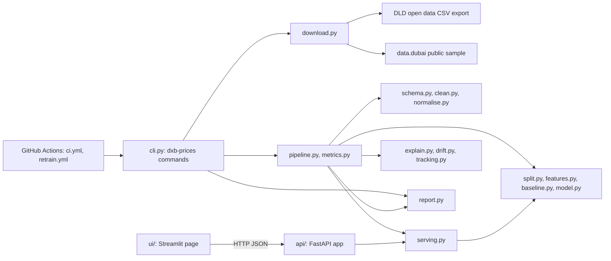

`serving.py` is the hinge of the design: the API and the evaluation both build
model rows through it, so the published accuracy is the accuracy of what the
API returns ([decision 15](docs/decisions.md#15-score-the-test-month-the-way-the-api-answers)).

### 1.5 High-level data flow

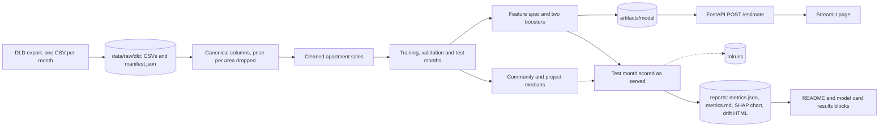

Raw data, cleaned data, models, MLflow runs and the drift HTML are git-ignored;
only this project's own evaluation results in `reports/` are committed
([data terms](docs/data.md#what-this-repository-does-as-a-result)).

## 2. Requirements

Status: **built** (in the code and covered by tests), **partly built**, or
**planned** (not in the code). Module numbers refer to section 4.

### 2.1 Functional requirements

| ID | Requirement | Met by | Status |
|---|---|---|---|
| FR-1 | Download DLD's transaction export one calendar month at a time for the current year, with a cache and a manifest of source, period, size, SHA-256, row count and a provisional flag | 4.2 Data acquisition, 4.12 Command line | Built |
| FR-2 | Fetch the data.dubai public sample to check the Dubai Pulse layout | 4.2, 4.15 Fixture and audit scripts | Built |
| FR-3 | Map both known source layouts onto one canonical column set and drop price-per-area columns before anything else runs | 4.3 Data preparation | Built |
| FR-4 | Clean to one row per apartment sale with fixed, documented rules, counting the rows each rule removes; normalise English and Arabic names | 4.3 | Built |
| FR-5 | Split by month into training, validation and test months; refuse fewer than four months; trim only large communities' training rows | 4.4 Split and features, 4.12 | Built |
| FR-6 | Train a full LightGBM model and a community-level model on log price per square metre; choose settings on the validation month; refit; score the test month once with the final models (the backtest's last fold and the cold-start refits score it again for reporting only, never to choose anything) | 4.4, 4.6 Price model, 4.8 Pipeline | Built |
| FR-7 | Compare with a community-median and a project-median baseline fitted on the same rows | 4.5 Baselines | Built |
| FR-8 | Score the test month the way the API answers, with and without the project, and report MdAPE, share within 10%, MAE, median error, 80% range coverage, segments and API refusals | 4.7 Serving rows, 4.8 | Built |
| FR-9 | Rolling-origin backtest and simulated cold start | 4.8 | Built |
| FR-10 | Per-estimate factors (top five and the rest) and a global SHAP importance chart | 4.6, 4.9 Explanations | Built |
| FR-11 | Record each training run and search trial in MLflow | 4.10 Drift and tracking | Built |
| FR-12 | Drift report comparing the test month with the training months | 4.10 | Built |
| FR-13 | Generate the report, the README and model card results blocks and the README sample from the run's results | 4.11 Reporting | Built |
| FR-14 | HTTP API: `POST /estimate` with validation, model routing, range, factors and warnings; `GET /projects`, `/communities`, `/model`, `/health` | 4.13 HTTP API, 4.7 | Built |
| FR-15 | A web page that values one apartment through the API, with the community's projects in a searchable list | 4.14 Streamlit page | Built |
| FR-16 | Monthly retraining that downloads, checks, trains, evaluates and uploads the report without deploying | 4.17 CI and automation | Partly built: written and linted, not yet run on GitHub |
| FR-17 | A demo and test path at any time of year from synthetic data | 4.15, 4.12 | Built |
| FR-18 | Fall back to, or blend with, the project or community median where the model knows little, with the rule chosen on the validation month | 4.5, 4.7, 4.8, 4.13 | Planned |
| FR-19 | 80% ranges that widen where errors are larger (ready units, expensive homes) | 4.6, 4.8 | Planned |
| FR-20 | Full transaction history through a data.dubai API key | 4.2 | Planned (needs a decision) |

### 2.2 Non-functional requirements

| ID | Requirement | Met by | Status |
|---|---|---|---|
| NFR-1 | No leakage: price-per-area columns dropped on read; features, trimming, lookups and baselines fitted on training rows only; the test month is never used to choose anything: the final models score it once, and the backtest's last fold and the cold-start refits score it again for reporting only | 4.3, 4.4, 4.5, 4.8 | Built |
| NFR-2 | Reproducibility: locked dependencies, a reference dev container, fixed seeds, snapshot checksums in the report, a deterministic fixture checked in CI | 4.1 Core, 4.2, 4.15, 4.16 Containers, 4.17 | Built |
| NFR-3 | Data terms: no raw or derived tables, no models and no median prices per community, project or segment committed or published (the docs quote a few single figures where a rule rests on them, as [docs/data.md](docs/data.md#what-this-repository-does-as-a-result) allows) | 4.11, 4.16, `.gitignore`, `.dockerignore` | Built |
| NFR-4 | Politeness to the source: one request per month, 3 s apart, retries only on network errors and HTTP 429, 500, 502, 503 and 504, a User-Agent that names the project, no imitation of the DLD page | 4.2 | Built |
| NFR-5 | Clear errors: one-line command errors with exit status 1, exit 3 for too little data; API 404 with suggestions, 422 with details, 503 without a model | 4.1, 4.12, 4.13 | Built |
| NFR-6 | Safe by default: ports published on 127.0.0.1 because the API has no authentication; non-root containers; read-only model mount; read-only CI token; `setup-uv` pinned to a commit and other actions to major tags; no secrets | 4.13, 4.16, 4.17 | Built |
| NFR-7 | Third-party usage telemetry (MLflow, Evidently, Streamlit) switched off | 4.1, 4.10, 4.14, 4.16 | Built |
| NFR-8 | Quality gates on every push to `main` and every pull request: lockfile, ruff, mypy strict, pytest on 3.12 to 3.14, actionlint, fixture reproducibility, Docker smoke test | 4.17 | Built |
| NFR-9 | Small serving footprint: the API image has only the base dependencies; Compose limits the API to 768 MB and 1 CPU | 4.6, 4.13, 4.16 | Built |
| NFR-10 | Portability: one lockfile for Linux, Windows and Apple-silicon macOS; Python 3.12 to 3.14 | `pyproject.toml`, 4.17 | Built |
| NFR-11 | Published numbers cannot drift from the run: generated blocks and hand-written findings checked against `reports/metrics.json`, except the README's sample API response, which `scripts/readme_sample.py` regenerates by hand from the model and which no test checks | 4.11, `tests/test_docs.py` | Built |
| NFR-12 | Measured latency and throughput for `POST /estimate` | 4.13 | Planned |

## 3. Architecture

### 3.1 Architectural style

- **One Python package, two runtimes.** `src/dxb_prices` holds an offline
  batch pipeline (download, clean, train, evaluate, report) and an online,
  stateless inference service (FastAPI). They share the feature, model and
  serving modules, so there is one implementation of "turn a request into a
  model row".
- **File-based hand-offs, no database.** Stages exchange files: the raw CSV
  cache and its manifest, the model directory, `reports/metrics.json`, and the
  Markdown rendered from it. MLflow keeps a local file store by default.
- **Thin clients.** The Streamlit page talks to the API only over HTTP and
  imports nothing from the model. The command line and GitHub Actions call
  the same `dxb-prices` commands a person runs.
- **Explicit contracts at the boundaries:** the model directory's four files,
  the keys of `metrics.json`, the JSON schemas in `api/schemas.py`, and the
  command exit codes 0, 1 and 3 that the retraining workflow relies on.

### 3.2 Layers and boundaries

Each layer uses only its own layer and the layers above it in the table, with
one exception: `download.py` imports `schema.EXPORT_COLUMNS` to name the
columns it requests. This is a convention, not enforced by a tool; the
dependency extras make two of the boundaries checkable (see below the table).

| Layer | Modules | Boundary contract | How the boundary is checked |
|---|---|---|---|
| Core | `config.py`, `errors.py`, `telemetry.py` | Settings dataclasses; `UserFacingError`; `errors.py` imports nothing | Imported by most modules |
| Ingestion | `download.py` | `data/raw/dld/transactions_YYYY-MM.csv` and `manifest.json` | `tests/test_download.py` |
| Preparation | `schema.py`, `normalise.py`, `clean.py` | Cleaned frame with `clean.CLEAN_COLUMNS`; `CleaningReport` | `tests/test_schema.py`, `tests/test_clean.py` |
| Synthetic data | `fixture.py` (imports `config` and `schema`) | Rows in the DLD export layout (`generate`, `write`) and `fixture.SETTINGS` | `tests/test_fixture.py`; the CI fixture check |
| Modelling | `split.py`, `features.py`, `baseline.py`, `model.py`, `serving.py` | Model directory: `model.lgb`, `model_community.lgb`, `features.json`, `metadata.json`; `serving.model_rows` | `tests/test_api.py` checks the API answers what the evaluation scores |
| Evaluation and reporting | `pipeline.py`, `metrics.py`, `explain.py`, `drift.py`, `tracking.py`, `report.py` | `reports/metrics.json` and the Markdown rendered from it | `tests/test_pipeline.py`, `tests/test_docs.py` |
| Interfaces | `cli.py`, `api/`, `ui/` | Exit codes; HTTP JSON; the page | `tests/test_cli.py`, `tests/test_api.py`, `tests/test_ui.py` |
| Scripts | `scripts/make_fixture.py` (uses `fixture`), `scripts/data_audit.py` (`config`, `schema`, `normalise`, `clean`), `scripts/readme_sample.py` (`config`, `api.app.create_app`) | Run from a checkout, not installed; they write the fixture CSV or the README sample block, or print to the terminal | The CI fixture check runs `make_fixture.py`; the other two are run by hand |
| Delivery | `Dockerfile`, `compose.yaml`, `.github/` | Images `dev`, `api`, `ui`; artefact `metrics-report-<run id>` | CI builds the images; the API container answers the smoke test with only the base dependencies installed |

Two dependency boundaries follow from the extras in `pyproject.toml`: the
`api` image installs only the base dependencies (FastAPI, LightGBM, NumPy,
pandas, pydantic, uvicorn), so the serving path cannot import `httpx`,
`mlflow`, `evidently`, `shap` or `matplotlib`; and `dxb-prices train-fixture`
runs with the base dependencies alone (the CI `docker` job does this), so the
core training path keeps the heavy libraries optional.

### 3.3 Runtime and deployment topology

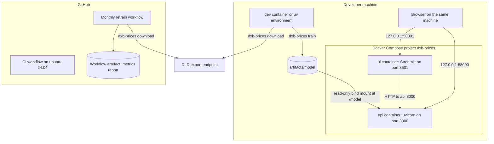

| Runtime | Where | What runs | State |
|---|---|---|---|
| Development and training | `dev` image (Python 3.12 on Debian bookworm, the reference environment) or a host `uv` environment | `dxb-prices` commands, tests, linters | Repository mounted at `/app`; `data/`, `artifacts/`, `mlruns/`, `reports/` on the host |
| API | `api` image, Compose service `api` | `uvicorn dxb_prices.api.app:app --host 0.0.0.0 --port 8000` as user `app` (uid 10001) | Model loaded once at start-up from `/model` (read-only) |
| Page | `ui` image, Compose service `ui` | `streamlit run streamlit_app.py` on port 8501, headless | In-memory cache only |
| CI | GitHub-hosted `ubuntu-24.04` runners | Lint, tests, image builds, API smoke test | Discarded after each run |
| Retraining | GitHub-hosted `ubuntu-24.04` runner | `download`, `check-data`, `train` | Empty cache each run; only the metrics report is kept, as an artefact for 90 days |

There is no hosted deployment, container registry or cloud environment, and
the repository does not plan one (see the decisions in section 7.2).

### 3.4 Key design decisions

The records in [docs/decisions.md](docs/decisions.md) give the context and
consequences; this table maps each one to the code that carries it out.

| # | Decision | Carried out in |
|---|---|---|
| [1](docs/decisions.md#1-data-comes-from-the-dld-open-data-export-one-month-at-a-time) | Data comes from the DLD export, one month per request, three seconds apart, current year only | `download.py` |
| [2](docs/decisions.md#2-no-source-data-in-the-repository) | No raw data, derived tables or models in the repository; no median prices per community, project or segment published (a few single figures are quoted where a rule rests on them) | `.gitignore`, `.dockerignore`, `scripts/readme_sample.py` |
| [3](docs/decisions.md#3-target-log-price-per-square-metre) | Target is log price per square metre; metrics on the price in dirhams | `model.log_price_per_sqm`, `PriceModel.predict` |
| [4](docs/decisions.md#4-temporal-split-selection-on-validation-one-look-at-the-test-month) | Temporal split; 12-point search on the validation month; refit; one look at the test month | `pipeline._select`, `pipeline._refit_and_test` |
| [5](docs/decisions.md#5-fixed-validity-rules-for-every-row-percentile-trimming-only-inside-large-communities-training-rows) | Fixed validity rules for every row; percentile trimming only inside large communities' training rows | `config.CleaningRules`, `split.trim_training` |
| [6](docs/decisions.md#6-which-sales-count), [6a](docs/decisions.md#6a-filter-to-sales-before-looking-for-repeated-transaction-numbers) | Which sales count; filter to sales before looking for repeated transaction numbers | `config.CleaningRules.market_sale_procedures`, `clean.clean` |
| [7](docs/decisions.md#7-high-cardinality-fields-native-categoricals-with-a-minimum-count) | LightGBM categoricals with minimum counts (30, 40, 30) | `config.FeatureRules`, `features.fit`, `model.BASE_PARAMS` |
| [8](docs/decisions.md#8-community-names-merged-through-their-arabic-registry-names) | Communities merged through their Arabic registry names | `normalise.canonical_english` |
| [9](docs/decisions.md#9-per-estimate-explanations-from-lightgbms-own-treeshap) | Per-estimate factors from LightGBM's own TreeSHAP | `PriceModel.contributions`, `PriceModel.explain` |
| [10](docs/decisions.md#10-each-models-80-range-comes-from-its-validation-residuals) | Each model's 80% range from its validation residuals | `pipeline._residual_quantiles`, `PriceModel.interval` |
| [11](docs/decisions.md#11-mlflow-with-a-local-file-store) | MLflow with a local file store; telemetry off | `tracking.resolve_uri`, `telemetry.opt_out` |
| [12](docs/decisions.md#12-develop-and-train-in-the-dev-container-test-on-python-312-to-314) | Dev container as reference; tests on Python 3.12 to 3.14 | `Dockerfile` (`dev`), `ci.yml` |
| [13](docs/decisions.md#13-retraining-never-deploys) | Retraining never deploys; runs on the 10th | `retrain.yml`, `download.PROVISIONAL_DAYS`, `cli.cmd_check_data` |
| [14](docs/decisions.md#14-a-community-level-model-for-requests-without-a-known-project) | A community-level model for requests without a known project | `features.COMMUNITY_FEATURES`, `serving.model_rows` |
| [15](docs/decisions.md#15-score-the-test-month-the-way-the-api-answers) | Score the test month the way the API answers | `serving.py`, `pipeline.score_period` |
| [16](docs/decisions.md#16-two-baselines-and-a-rolling-origin-backtest) | Two baselines and a rolling-origin backtest | `baseline.py`, `pipeline.backtest` |
| [17](docs/decisions.md#17-a-project-is-its-community-and-its-name) | A project is its community and its name | `features.project_key`, `FeatureSpec.has_project` |
| [18](docs/decisions.md#18-error-analysis-for-new-buildings-and-thin-communities) | Error analysis for new buildings and thin communities; simulated cold start | `pipeline._project_segment`, `pipeline.cold_start` |

## 4. Modules

Every file under `src/` and `scripts/`, and every container and workflow file,
belongs to one of the seventeen modules below; the tests are named under each
module's Testing heading, and the project-wide files that serve all modules
are listed after the module table. Each module uses the same fifteen headings
in the same order. Three of them need a
definition in this project:

- **Database interaction.** The system has no database. Under this heading
  each module lists the files or stores it reads and writes; MLflow's optional
  SQLite store is the only database the code can use.
- **Frontend interaction.** What a person sees: the Streamlit page, an API
  response, generated documents, or terminal output.
- **Backend interaction.** Which other modules this one calls, and which call it.

| Module | Files |
|---|---|
| [4.1 Core: configuration, errors and telemetry](#41-core-configuration-errors-and-telemetry) | `src/dxb_prices/config.py`, `errors.py`, `telemetry.py`, `__init__.py` |
| [4.2 Data acquisition](#42-data-acquisition) | `src/dxb_prices/download.py` |
| [4.3 Data preparation](#43-data-preparation) | `src/dxb_prices/schema.py`, `normalise.py`, `clean.py` |
| [4.4 Temporal split and features](#44-temporal-split-and-features) | `src/dxb_prices/split.py`, `features.py` |
| [4.5 Baselines](#45-baselines) | `src/dxb_prices/baseline.py` |
| [4.6 Price model](#46-price-model) | `src/dxb_prices/model.py` |
| [4.7 Serving rows](#47-serving-rows) | `src/dxb_prices/serving.py` |
| [4.8 Training and evaluation pipeline](#48-training-and-evaluation-pipeline) | `src/dxb_prices/pipeline.py`, `metrics.py` |
| [4.9 Explanations](#49-explanations) | `src/dxb_prices/explain.py` |
| [4.10 Drift and experiment tracking](#410-drift-and-experiment-tracking) | `src/dxb_prices/drift.py`, `tracking.py` |
| [4.11 Reporting and generated documentation](#411-reporting-and-generated-documentation) | `src/dxb_prices/report.py`, `scripts/readme_sample.py` |
| [4.12 Command line](#412-command-line) | `src/dxb_prices/cli.py` |
| [4.13 HTTP API](#413-http-api) | `src/dxb_prices/api/__init__.py`, `app.py`, `schemas.py`, `estimator.py` |
| [4.14 Streamlit page](#414-streamlit-page) | `src/dxb_prices/ui/__init__.py`, `client.py`, `streamlit_app.py`, `.streamlit/config.toml` |
| [4.15 Synthetic fixture and audit scripts](#415-synthetic-fixture-and-audit-scripts) | `src/dxb_prices/fixture.py`, `scripts/make_fixture.py`, `tests/fixtures/transactions_synthetic.csv`, `scripts/data_audit.py` |
| [4.16 Containers and Compose](#416-containers-and-compose) | `Dockerfile`, `compose.yaml`, `.env.example`, `.dockerignore` |
| [4.17 CI, retraining and dependency automation](#417-ci-retraining-and-dependency-automation) | `.github/workflows/ci.yml`, `.github/workflows/retrain.yml`, `.github/dependabot.yml`, `tests/test_repo_consistency.py` |

Project-wide files that are not a module of their own:

| File | What it holds | Relied on by |
|---|---|---|
| `pyproject.toml` | Package metadata (`dxb-prices` 0.1.0, MIT, Python `>=3.12`); the base dependencies; the extras `train` (evidently, httpx, matplotlib, mlflow, pyarrow, shap) and `ui` (httpx, streamlit); the console script `dxb-prices = "dxb_prices.cli:main"`; the `dev` dependency group (mypy, pandas-stubs, pytest, pytest-cov, ruff); the hatchling build; `[tool.uv]` default groups and the three supported environments (Linux, Windows, Apple-silicon macOS); ruff, mypy (strict, with the pydantic plugin), pytest and coverage settings | Every install (`uv sync`, the `Dockerfile`, both workflows), 4.12, 4.16, 4.17; NFR-9 and NFR-10 |
| `uv.lock` | The resolved versions, with hashes, for the three environments | `uv sync --frozen` in the images and workflows; `uv lock --check` in CI; Dependabot's `uv` updates |
| `.gitignore` | Keeps `data/`, `artifacts/`, `mlruns/`, `mlflow.db`, `reports/drift/`, `.env` and tool caches out of git | NFR-3 and [decision 2](docs/decisions.md#2-no-source-data-in-the-repository) |
| `.gitattributes` | LF line endings for text; binary handling for images, PDFs, `.parquet`, `.gz` and `.lgb` | The same line endings in Windows and Linux checkouts |
| `LICENSE` | MIT licence for the code | Copied into the image build stages because `pyproject.toml` names it |
| `tests/conftest.py`, `tests/__init__.py` | Shared session fixtures: the synthetic CSV read (`raw_fixture`) and cleaned (`clean_fixture`), a small model trained on it once (`tiny_model_dir`, `tiny_model`), and the `dld_rows` helper | `tests/test_schema.py`, `test_clean.py`, `test_split.py`, `test_model.py`, `test_serving.py`, `test_pipeline.py`, `test_drift_and_report.py`, `test_api.py`, `test_ui.py` |
| `README.md`, `docs/`, `reports/` | The documents this plan links to; `reports/` holds the committed results of the published run | 4.11 writes the generated parts |

### 4.1 Core: configuration, errors and telemetry

#### Purpose

One home for paths, source URLs and every numeric rule that changes which rows
the model sees; the exception base that the command line reports without a
traceback; and the switch that turns off MLflow's and Evidently's usage
telemetry before either library is imported.

#### Requirements

NFR-1 (thresholds in one place, mirrored in [docs/data.md](docs/data.md#cleaning-rules)),
NFR-2 (fixed seed), NFR-5 (one-line errors), NFR-7 (telemetry off).

#### Architecture

Frozen dataclasses grouped under `config.Settings`, with `DEFAULT_SETTINGS` as
the instance the commands use (`train-fixture` uses `fixture.SETTINGS`); module-level path constants read from the
environment when `config` is imported. `errors.py` imports nothing, so
`cli.py` can use it without loading pandas or LightGBM.

#### Workflow

1. Importing `config` resolves `DXB_DATA_DIR`, `DXB_ARTIFACTS_DIR`,
   `DXB_MODEL_DIR` and `DXB_REPORTS_DIR`, each falling back to a folder under
   the repository root (`PROJECT_ROOT`).
2. `cli.main` calls `telemetry.opt_out()` first; `tracking` and `drift` call it
   again when they are imported. It sets `MLFLOW_DISABLE_TELEMETRY=true`,
   `DO_NOT_TRACK=true` and `EVIDENTLY_DISABLE_TELEMETRY=1`, keeping any value
   the user has already set.
3. Modules raise subclasses of `UserFacingError`; `cli.main` prints them as one
   line and exits with status 1.

#### Components

| Name | Contents |
|---|---|
| `DATA_DIR`, `RAW_DIR`, `ARTIFACTS_DIR`, `MODEL_DIR`, `REPORTS_DIR` | `./data`, `./data/raw/dld`, `./artifacts`, `./artifacts/model`, `./reports` by default |
| `DLD_EXPORT_URL`, `DLD_PAGE_URL` | The CSV export endpoint and the DLD open data page |
| `DUBAI_DATA_DOWNLOAD_URL`, `DUBAI_DATA_PAGE_URL`, `DUBAI_DATA_DATASET_ID` | The data.dubai sample (dataset 470061) |
| `USER_AGENT` | `dxb-prices/0.1 (personal portfolio project; +https://github.com/fasharif/dxb-prices)` |
| `CleaningRules` | Size 18 to 3,000 sqm; price AED 100,000 to 500 million; 2,500 to 250,000 AED per sqm; sub-types Flat and Hotel Apartment; eleven market sale procedures |
| `TrainingTrim` | Quantiles 0.005 and 0.995 |
| `FeatureRules` | Minimum training rows for a level of its own: community 30, project 40, nearest metro, mall or landmark 30 |
| `SplitRules` | 1 test month, 1 validation month, at least 2 training months |
| `SegmentRules` | Price bands at AED 1M, 2M and 5M; a community is thin below 50 training rows |
| `BaselineRules` | A project needs 5 training sales for its own median |
| `ColdStartRules` | 5 groups; 0 and 10 kept training sales |
| `Settings.random_seed` | 42 |
| `errors.UserFacingError`, `errors.MissingInputError` | Base for errors a user can fix; `MissingInputError` is also a `FileNotFoundError` |
| `telemetry.OPT_OUT`, `telemetry.opt_out()` | The three environment variables and the function that sets them |

#### APIs

Python only: `config.DEFAULT_SETTINGS`, `config.Settings(...)` (the fixture
builds its own, `fixture.SETTINGS`), the path constants and
`telemetry.opt_out()`. No HTTP or command-line surface.

#### Data flow

Environment variables become path constants, which become the defaults of
the `dxb-prices` path options (`--raw-dir`, `--model-dir`, `--reports-dir`,
`--metrics`). `Settings` flows into `clean`, `split`, `features`,
`baseline` and `pipeline`; `api/schemas.py` reuses `CleaningRules.min_area_sqm`
and `max_area_sqm` as the request's size bounds.

#### Database interaction

Not applicable: the module holds constants and reads environment variables; it
reads and writes no files.

#### Frontend interaction

Indirect only: the size bounds that the API enforces (18 to 3,000 sqm) come
from here, and the Streamlit page repeats them in its size input.

#### Backend interaction

Imported by almost every module. `download.DownloadError`,
`download.MonthError`, `schema.SchemaError` and `split.InsufficientDataError`
subclass `UserFacingError`. `cli`, `tracking` and `drift` call
`telemetry.opt_out()`.

#### Authentication/authorization

Not applicable: no credentials exist; `.env.example` states that no secrets
are needed.

#### Validation

None at runtime: the rules are constants, reviewed in code and documented in
[docs/data.md](docs/data.md#cleaning-rules). The dataclasses are frozen, so
nothing can change a rule during a run.

#### Error handling

Every `UserFacingError` subclass also keeps a built-in base (`ValueError`,
`FileNotFoundError` or `RuntimeError`), so callers that catch those still work.

#### Testing

`tests/test_telemetry.py` imports `dxb_prices.tracking` and `dxb_prices.drift`
in a subprocess with a clean environment and checks that MLflow did not start
its telemetry client and that `DO_NOT_TRACK` is set. The thresholds are
exercised by `tests/test_clean.py`, `tests/test_split.py` and
`tests/test_features.py`.

#### Deployment

Part of the package in the `api` and `ui` images; the `dev` image holds only
the dependencies and runs the mounted repository. The `api` image sets
`DXB_MODEL_DIR=/model`; the other `DXB_` path variables are set by the user
(see section 6.2).

### 4.2 Data acquisition

#### Purpose

Fetch DLD's transaction CSV export one calendar month at a time into a local
cache, with a manifest that records each file's source, period, size, SHA-256,
row count and whether the month was final when downloaded; also fetch the
data.dubai public sample for checking the Dubai Pulse layout.

#### Requirements

FR-1, FR-2, NFR-2 (checksums identify the snapshot), NFR-4, NFR-5.

#### Architecture

A module of plain functions around an `httpx.Client`. The client and the
`sleep` function can be injected, which is how the tests replace the network
and the clock. Files are written atomically (a `.part` file, then a rename);
the manifest is a JSON file saved after every month.

#### Workflow

1. `available_months(today)` lists January to the last complete month of the
   current year (with `include_partial`, the current month too).
2. `check_in_window` refuses months outside the current year or in the future,
   before any request is sent.
3. For each month in order, `_is_fresh` skips it when the manifest says it was
   final and the file on disk has the recorded size and SHA-256, unless
   `--force` is given.
4. Otherwise, after a 3-second pause if another month was already fetched in
   this run, `_post_with_retries` posts `export_body(first_day, end)` to
   `DLD_EXPORT_URL`, where `end` is the month's last day or today.
5. `validate_csv` checks the response is not an HTML page, decodes it as UTF-8
   (with or without a byte-order mark), counts rows and requires
   `TRANSACTION_NUMBER`, `INSTANCE_DATE`, `TRANS_VALUE` and `ACTUAL_AREA`.
6. `_write_atomic` writes `transactions_YYYY-MM.csv`; a `ManifestEntry` is
   added with `final = today >= last_day + PROVISIONAL_DAYS` (7 days) and the
   manifest is saved.

#### Components

`Month` (`parse`, `label`, `first_day`, `last_day`), `available_months`,
`check_in_window`, `export_body`, `ManifestEntry`, `Manifest`, `sha256_of`,
`validate_csv`, `_post_with_retries`, `_write_atomic`, `_is_fresh`,
`export_client`, `download_months`, `download_dubai_data_sample`; constants
`REQUIRED_COLUMNS`, `MANIFEST_NAME` (`manifest.json`), `PROVISIONAL_DAYS = 7`,
`RETRY_STATUS = {429, 500, 502, 503, 504}`, `MANUAL_DOWNLOAD`; errors
`DownloadError` and `MonthError`.

#### APIs

| Direction | Call |
|---|---|
| Outbound | `POST https://gateway.dubailand.gov.ae/open-data/transactions/export/csv`; JSON body with `parameters` (`P_FROM_DATE` and `P_TO_DATE` as MM/DD/YYYY, `P_TAKE` `-1`, `P_SORT` `TRANSACTION_NUMBER_ASC`, every filter empty), `command` `transactions` and `labels` naming each of `schema.EXPORT_COLUMNS`; the client sets a `User-Agent` header and no `Origin` or `Referer`; timeout 180 s (connect 30 s) |
| Outbound | `GET https://data.dubai/o/dda/data-services/dataset-metadata?datasetId=470061&download=true` with `Accept: application/json`; timeout 120 s |
| Command | `dxb-prices download [--months YYYY-MM ...] [--include-partial] [--force] [--raw-dir DIR] [--source dld\|dubai-data-sample]` |

#### Data flow

DLD CSV bytes are validated and written to
`data/raw/dld/transactions_YYYY-MM.csv`, with an entry in
`data/raw/dld/manifest.json`. `schema.read_raw_csvs` reads the CSVs for
training; `cli.data_info` reads the manifest for the report's data snapshot
table. The data.dubai sample's JSON rows are written as
`data/raw/dubai_data/real_estate_transactions_sample.csv` with its own
manifest.

#### Database interaction

No database. Writes the CSV files and `manifest.json`
(`{"files": {name: {file, source, url, period_start, period_end, downloaded_at, bytes, sha256, rows, final}}}`)
under `data/`, which is git-ignored.

#### Frontend interaction

Terminal only: one INFO line per month ("cache hit ..." or "downloaded ...: N
rows, N bytes, sha256 ...", with "(provisional: will be refreshed on the next
run)" for a provisional month), a WARNING line before each retry, and a
one-line error on failure.

#### Backend interaction

Called by `cli.cmd_download`. Uses `config` and `schema.EXPORT_COLUMNS`.
`cli.data_info` and `cli.cmd_check_data` use its `Manifest`, `sha256_of`,
`MANIFEST_NAME`, `PROVISIONAL_DAYS` and `Month`.

#### Authentication/authorization

None: both endpoints are public. Requests identify the project through
`USER_AGENT` and send no `Origin` or `Referer` header
([decision 1](docs/decisions.md#1-data-comes-from-the-dld-open-data-export-one-month-at-a-time)).
The full data.dubai table needs an API key; that route is not built.

#### Validation

Month format and range (`Month.parse`); year window and future months
(`check_in_window`); `attempts` of at least 1; content type and a leading
`<!doctype html`; UTF-8 and CSV decoding; required columns.

#### Error handling

Transport errors and HTTP 429, 500, 502, 503 and 504 are retried after 5 s
and then 10 s (three attempts in all); any other status fails at once.
Request, response and month failures are `DownloadError` or `MonthError`,
which the command line prints as one line. Disk errors, a corrupt
`manifest.json`, and network or non-JSON errors from the data.dubai sample are
not wrapped and end with a traceback and exit 1. The full list is in
section 5.1.

#### Testing

`tests/test_download.py` uses `httpx.MockTransport` (the `Recorder` helper) to
cover the month window, a client that names the project and sends no `Origin`
or `Referer`, the request body, the file
and manifest with checksum, cache hits, provisional and corrupted files being
fetched again, `--force`, HTML pages, missing columns, non-UTF-8 bodies, retries
with back-off, no retry on client errors, the pause between months, and the
data.dubai sample's success and failure. `tests/test_cli.py` covers January
and requests for other years.

#### Deployment

Needs the `train` extra (`httpx`). Runs in the `dev` container, in a host
`uv` environment and in `retrain.yml`. `httpx` is not installed in the `api`
image, so the API cannot import this module.

### 4.3 Data preparation

#### Purpose

Turn raw CSVs in either known layout into one row per apartment sale with
canonical columns, dropping price-per-area columns first and recording how
many rows each rule removes; match English and Arabic names of the same place.

#### Requirements

FR-3, FR-4, NFR-1.

#### Architecture

Three pure-pandas parts. `schema` renames, drops leaky columns and coerces
types without filtering rows. `clean` applies ordered rules through a
`_Tracker` that records a `CleaningStep` for each. `normalise` builds matching
keys for English and Arabic names and merges English spellings that share an
Arabic key (a union-find over keys).

#### Workflow

1. `schema.read_raw_csvs(paths)` reads every file as text (UTF-8, byte-order
   mark allowed, no automatic missing values) and concatenates them.
2. `schema.to_canonical`: `detect_layout` (`dld_export` when
   `TRANSACTION_NUMBER` and `TRANS_VALUE` are present, `dubai_data` when
   `transaction_id` and `actual_worth` are); drop `LEAKY_COLUMNS`; rename with
   `DLD_EXPORT_MAP` or `DUBAI_DATA_MAP`; add missing canonical columns; coerce
   dates, numbers and the off-plan and freehold flags; blank-like strings
   become missing.
3. `clean.clean`: refuse leaky columns; fill `area_sqm` from
   `procedure_area_sqm`; then, in order, Parse, Exact duplicates, Sales only,
   Location duplicates, Multi-unit deals, Market sales, Apartments, Size
   bounds, Price bounds and Price per sqm bounds.
4. Build `CLEAN_COLUMNS`: `community` from
   `normalise.canonical_english(community_en, community_ar)`, `project` from
   `canonical_english(project_en)`, `rooms` from `parse_rooms`, the month as
   `YYYY-MM`; the last step, Community known, drops rows without a community;
   rows are sorted by date and transaction number.

The rules and their reasons are in [docs/data.md](docs/data.md#cleaning-rules).

#### Components

`schema`: `EXPORT_COLUMNS`, `LEAKY_COLUMNS`, `CANONICAL_COLUMNS` (23),
`DLD_EXPORT_MAP`, `DUBAI_DATA_MAP`, `SchemaError`, `detect_layout`,
`to_canonical`, `read_raw_csvs`. `clean`: `ROOM_LEVELS`, `CLEAN_COLUMNS` (17),
`CleaningStep`, `CleaningReport` (`to_markdown`, `as_records`), `parse_rooms`,
`clean`. `normalise`: `display_en`, `key_en`, `key_ar`, `readable`,
`canonical_english`, `lookup_table`, `resolve_name`.

#### APIs

Python only. `pipeline.load_and_clean(raw_paths, settings)` chains the three
for `dxb-prices train` and `train-fixture`; `normalise.resolve_name` resolves
user-typed names in the API.

#### Data flow

Raw CSV text becomes a typed canonical frame, then the cleaned frame and a
`CleaningReport`. The cleaned frame goes to `pipeline`; the report's records
become `metrics.json` `cleaning` and the table in
[reports/metrics.md](reports/metrics.md#cleaning).

#### Database interaction

No database. Reads the cached CSV files it is given; writes nothing.

#### Frontend interaction

Indirect: the cleaning table in the report, and the normalised community and
project names that `/communities` and `/projects` list and the page shows.

#### Backend interaction

Called by `pipeline.load_and_clean` and `scripts/data_audit.py`. `features.fit`
uses `normalise.lookup_table`; `api/estimator.py` uses `normalise.resolve_name`;
`features`, `serving` and `pipeline` use `clean.ROOM_LEVELS`.

#### Authentication/authorization

Not applicable: works on local files only.

#### Validation

Layout detection; the leaky-column guard in `clean`; coercion with
`errors="coerce"` (unparseable values become missing, and Parse drops rows
without a transaction number, date, price or size); the fixed validity rules
from `CleaningRules`.

#### Error handling

`SchemaError` (user-facing) for an unknown layout; `MissingInputError` for an
empty file list; `ValueError("price-per-area columns must be dropped first: [...]")`
as a guard against calling `clean` without `to_canonical`. Rows that fail a
rule are removed and counted, never raised.

#### Testing

`tests/test_schema.py` (both layouts, types, leaky columns dropped, byte-order
mark, empty cache message), `tests/test_clean.py` (each rule, luxury sales
survive, area fallback, leaky guard, room parsing, names, report chaining, the
fixture's expected rows), `tests/test_normalise.py`.

#### Deployment

Base dependencies only. Included in the `api` image, because `serving` imports
`clean.ROOM_LEVELS` and the estimator uses `normalise`.

### 4.4 Temporal split and features

#### Purpose

Split the months into training, validation and test without leakage, trim only
training rows, and build both the model matrices and the lookup tables the API
uses to fill in what a caller cannot supply.

#### Requirements

FR-5, FR-6, NFR-1.

#### Architecture

`split.plan` returns a `TemporalSplit`; `split.apply` slices a frame by month;
`split.trim_training` trims. `features.fit` returns a JSON-serialisable
`FeatureSpec`; `features.transform` builds a matrix for one model. The full
model uses `FEATURES` (four numeric and seven categorical features); the
community-level model uses `COMMUNITY_FEATURES`, the same without the project
and the nearest metro, mall and landmark. A project's model level is
`project_key(community, project)`, joined by the control character `\x1f`
([decision 17](docs/decisions.md#17-a-project-is-its-community-and-its-name)).

#### Workflow

1. `plan(months, SplitRules)` sorts the distinct months, requires four, and
   makes the newest the test month, the one before it the validation month and
   the rest training months.
2. `apply` returns the three frames.
3. `trim_training(train, TrainingTrim, min_group_rows=200)` drops the 0.5%
   tails of log price per square metre inside each community with at least 200
   rows; smaller communities are not trimmed.
4. `fit(train, FeatureRules)` records: category levels (values with at least
   30 training rows for the community, 40 for the project key and 30 for each
   nearest-place field; fixed lists for rooms and sub-type) plus `__other__`
   and `__none__`; the reference month; training
   rows per community; per project, its most common location labels and
   freehold flag and its row count, keyed by community then project; the same
   labels per community; and lookup tables from every English and Arabic
   spelling to the canonical name.
5. `transform(frame, spec, columns)` maps rare or unseen values to `__other__`
   and missing ones to `__none__`, and turns the month into `month_index`
   relative to the reference month.

#### Components

`split`: `TemporalSplit` (`describe`), `InsufficientDataError`, `plan`, `apply`,
`trim_training`. `features`: `FeatureSpec` (`to_dict`, `from_dict`,
`has_project`, `project_has_own_level`), `fit`, `transform`, `project_key`,
`project_keys`, `month_number`, `month_index`, and the constants `OTHER`,
`MISSING`, `NUMERIC_FEATURES`, `CATEGORICAL_FEATURES`, `FEATURES`,
`COMMUNITY_FEATURES`, `VARIANT_FEATURES`, `FULL`, `COMMUNITY`,
`CONTEXT_COLUMNS`, `PROJECT_KEY_SEP`.

#### APIs

Python only. `split.plan` is also used by `dxb-prices check-data`.

#### Data flow

The cleaned frame's months become three frames; trimmed training rows become a
`FeatureSpec`, which `PriceModel.save` writes as `features.json` and the API
loads at start-up.

#### Database interaction

No database. The `FeatureSpec` is persisted as `features.json` in the model
directory by the price model (4.6).

#### Frontend interaction

`community_rows` and `project_rows` are what `/communities` and `/projects`
return, and so what the page's pickers offer. In the factor list, `__other__`
shows as "(rare or new: grouped as other)" and `__none__` as "not recorded".

#### Backend interaction

Used by `pipeline` (`_prepare`, `_booster`), `model` (`PriceModel.matrix`),
`serving` (context lookups and routing), `api/estimator.py` (`month_number`,
`FULL`) and `cli.cmd_check_data` (`split.plan`).

#### Authentication/authorization

Not applicable: in-process data structures only.

#### Validation

`plan` raises `InsufficientDataError` with fewer than four months; `fit`
refuses an empty training set; `transform` raises
`KeyError("frame is missing columns: [...]")`; `FeatureSpec.from_dict` refuses a
spec whose project tables are not keyed by community.

#### Error handling

`InsufficientDataError` is user-facing: `train` exits 1 and `check-data`
exits 3. A spec from an older version raises "the saved feature spec was
written by an older version of dxb-prices (its project tables are not keyed by
community); train the model again", which the API reports as 503.

#### Testing

`tests/test_split.py` (newest months held out, too few months, disjoint
periods, trimming only extremes, small communities untouched) and
`tests/test_features.py` (levels, unseen, rare and missing values, fitting
only on the rows given, column order, community-level features, no price
information in the features, lookups from training rows, one name in two
communities, JSON round trip, older spec refused, missing columns, empty
training set).

#### Deployment

Base dependencies only; part of the `api` and `ui` images (the `dev` image
holds only the dependencies and runs the mounted repository).

### 4.5 Baselines

#### Purpose

The two rules of thumb the models must beat: the community's median price per
square metre times the size (the brief's baseline), and the project's median
when it has at least five training sales, otherwise the community's
([decision 16](docs/decisions.md#16-two-baselines-and-a-rolling-origin-backtest)).

#### Requirements

FR-7, FR-8.

#### Architecture

Two dataclasses with `fit`, `per_sqm` and `predict`.
`CommunityMedianBaseline` falls back to the median of all training sales for a
community it has not seen. `ProjectMedianBaseline` wraps one and keys its
medians by community, then project.

#### Workflow

Fitted on the same trimmed rows as the models in every fit (selection, final
fit, each backtest fold, each cold-start refit), then asked for the validation
or test month's prices.

#### Components

`CommunityMedianBaseline` (`fit`, `per_sqm`, `predict`, `covered`, `to_dict`,
`from_dict`) and `ProjectMedianBaseline` (`fit`, `per_sqm`, `predict`).

#### APIs

Python only. The community medians reach API users as
`community_median_per_sqm_aed`.

#### Data flow

Training rows become medians; `pipeline.score_period` adds
`pred_project_baseline` and `pred_baseline` columns, which are scored like the
models. The community medians are saved in `metadata.json`.

#### Database interaction

No database. `metadata.json` holds `baseline.medians` and
`baseline.global_median` (community medians only); the project medians are not
saved.

#### Frontend interaction

The page shows "Baseline for comparison: ... training-period median of AED ...
per sqm" when the response carries a community median. The README sample
leaves the value out
([decision 2](docs/decisions.md#2-no-source-data-in-the-repository)).

#### Backend interaction

Created by `pipeline._assemble`; `to_dict` is called by
`pipeline._model_metadata`; `api/estimator.Estimator` reads
`metadata["baseline"]["medians"]`.

#### Authentication/authorization

Not applicable: in-process arithmetic only.

#### Validation

`fit` refuses an empty training set ("cannot fit the baseline on an empty
training set").

#### Error handling

No errors at prediction time: unknown communities use the global median, and
projects below the minimum use their community's median.

#### Testing

`tests/test_baseline.py`: the community median, the global fallback, test
prices never reaching the baseline, a JSON round trip, the project median's
minimum and fallback, and the empty-set refusal.

#### Deployment

Base dependencies. Used only during training; only the community medians reach
the API, through `metadata.json`.

### 4.6 Price model

#### Purpose

Train, save, load and run the two LightGBM boosters, and produce each
estimate's 80% range and its TreeSHAP factors.

#### Requirements

FR-6, FR-10, NFR-9.

#### Architecture

`PriceModel` holds `boosters` (`full` and `community`), one shared
`FeatureSpec` and a `metadata` dict. Both boosters predict the natural log of
price per square metre
([decision 3](docs/decisions.md#3-target-log-price-per-square-metre)). The
range adds the validation residuals' 10th and 90th percentiles to the log
prediction ([decision 10](docs/decisions.md#10-each-models-80-range-comes-from-its-validation-residuals)).
Factors come from `booster.predict(..., pred_contrib=True)`
([decision 9](docs/decisions.md#9-per-estimate-explanations-from-lightgbms-own-treeshap)).

#### Workflow

1. `train_booster` merges `BASE_PARAMS` with the chosen settings, builds an
   `lgb.Dataset` with the categorical features, and trains for up to 5,000
   rounds, stopping early after 100 rounds without improvement when a
   validation set is given.
2. `predict` returns `exp(log prediction) * size`; `interval` returns the
   range; `contributions` returns the TreeSHAP values plus `bias`.
3. `explain(frame, top_k=5)` orders the contributions by size and returns an
   `Explanation` with the five largest `Factor`s and the sum of the rest.
4. `save` writes the four files; `load` checks they exist and rebuilds the
   model.

#### Components

`MODEL_FILES` (`model.lgb`, `model_community.lgb`), `SPEC_FILE`
(`features.json`), `META_FILE` (`metadata.json`), `BASE_PARAMS` (learning rate
0.05, 63 leaves, 30 rows per leaf, `cat_smooth` 10, `cat_l2` 10,
`min_data_per_group` 50, metric `l1`, `deterministic`, 4 threads, seed 42),
`SEARCH_SPACE` (12 settings: `regression`, `huber` with alpha 0.15 and
`regression_l1`; 31 or 127 leaves; 20 or 60 rows per leaf),
`log_price_per_sqm`, `train_booster`, `Factor`, `Explanation`, `PriceModel`
(`matrix`, `predict_log_pps`, `predict`, `interval`, `contributions`,
`explain`, `base_per_sqm`, `save`, `load`).

#### APIs

Python only.

#### Data flow

Feature matrices and log targets become boosters; the boosters, spec and
metadata become the model directory; a loaded model turns served rows into
estimates, ranges and factors.

#### Database interaction

No database. The model directory (default `artifacts/model`, git-ignored)
holds `model.lgb` and `model_community.lgb` (LightGBM text models),
`features.json` and `metadata.json`. `metadata.json` has `model_version`,
`trained_at`, `target`, `trained_on_months`, `evaluated_on_months`,
`data_period_end`, `residual_quantiles`, `base_per_sqm`, `baseline`,
`test_scores`, `thin_community_rows` and `params`.

#### Frontend interaction

The factors become the response's `top_factors` and `other_factors_effect_pct`,
which the page shows as a table under "Top factors".

#### Backend interaction

Used by `pipeline`, `serving`, `explain` and the API (`create_app`'s start-up
and `Estimator`).

#### Authentication/authorization

Not applicable. The model directory is trusted input: nothing verifies its
integrity or that the four files come from the same run.

#### Validation

`PriceModel.__init__` requires a booster for each model; `load` requires all
four files; `FeatureSpec.from_dict` checks the spec's layout.

#### Error handling

`load` raises `MissingInputError` naming the missing files and saying "train
one with `dxb-prices train` (real data) or `dxb-prices train-fixture`
(synthetic)". Load failures (`OSError`, `ValueError`, `KeyError`,
`LightGBMError`) are caught by the API at start-up (section 5.5).

#### Testing

`tests/test_model.py`: positive prices, identical predictions after save and
load, both models required, the community-level model ignoring the project and
location labels, contributions adding up to the prediction, the top factors,
factors reconciling with the estimate, the `shap` library agreeing with
LightGBM within 1e-6, the range bracketing the estimate, the missing-model
message, and the importance chart.

#### Deployment

Base dependencies; LightGBM needs `libgomp1`, which every image installs. The
API loads the model directory from `/model`, mounted read-only.

### 4.7 Serving rows

#### Purpose

Build model rows from what a caller supplies, fill in what callers cannot
supply from the training rows, and send each row to the full or the
community-level model. The API and the evaluation both use it
([decisions 14 and 15](docs/decisions.md#14-a-community-level-model-for-requests-without-a-known-project)).

#### Requirements

FR-8, FR-14.

#### Architecture

Pure functions over a `FeatureSpec`. A row goes to the full model only when
`spec.has_project(community, project)`, that is, when the project has training
sales in that community.

#### Workflow

1. `model_rows(requests, spec)` checks the eight `REQUEST_COLUMNS`, marks which
   projects are known in their community, and blanks the others.
2. For the nearest metro, mall and landmark and the freehold flag, it takes the
   project's most common training value, else the community's; a freehold flag
   given by the caller wins.
3. It adds `variant` (`full` or `community`).
4. `estimate(model, rows)` predicts each model's rows, with the 80% range.
5. For evaluation, `requests_from_sales(sales, with_project=...)` turns recorded
   sales into requests without location labels or freehold flag, and
   `refusals(sales, spec)` counts the sales the API would refuse (a community
   without training sales, 404; a room count not recorded, 422).

#### Components

`API_ROOMS`, `REQUEST_COLUMNS`, `model_rows`, `estimate`,
`requests_from_sales`, `refusals`.

#### APIs

Python only.

#### Data flow

A request frame (community, project, rooms, sub-type, size, off-plan,
freehold, month) becomes a filled frame with a `variant`, then estimates with
`low` and `high`.

#### Database interaction

Not applicable: reads only the in-memory `FeatureSpec`.

#### Frontend interaction

Decides `model_variant` in the response, which the page turns into "Estimated
by the model that knows the project" or "the community-level model (no
project)".

#### Backend interaction

Called by `api/estimator.Estimator.estimate`, `pipeline.score_period` and
`pipeline._write_reports`; calls `PriceModel.predict` and `interval`.

#### Authentication/authorization

Not applicable: in-process functions only.

#### Validation

`model_rows` raises `KeyError("requests are missing columns: [...]")`.

#### Error handling

An unknown community leaves the filled labels empty (`__none__`) rather than
failing; the API refuses unknown communities before calling this module.

#### Testing

`tests/test_serving.py` (routing, labels, a project recorded in another
community, refusal counts, accepted room counts, a given freehold flag, missing
columns, requests built from sales, estimates per model).
`tests/test_api.py::test_the_api_answers_what_the_evaluation_scores` and
`tests/test_pipeline.py::test_served_scores_match_the_api_path` pin the API and
the evaluation together.

#### Deployment

Base dependencies; part of the `api` image.

### 4.8 Training and evaluation pipeline

#### Purpose

Orchestrate selection, refit, test scoring as served, error analysis,
backtest, cold start, model metadata, saving, reports and tracking; compute
the metrics.

#### Requirements

FR-6 to FR-12, NFR-1, NFR-2.

#### Architecture

One entry point, `train_and_evaluate(cleaned, settings, *, model_dir,
reports_dir, search, run_backtest, run_cold_start, cleaning_report, data_info,
track, tracking_uri, drift_html, shap_sample=5000)`, returning
`TrainingOutcome(model, results)`. Internal dataclasses `_Fit`, `_Selection`
and `_Evaluation` carry state between stages. The optional stages import
`tracking`, `drift` and `explain` only when they run.

#### Workflow

The steps are in section 5.2. In short: `split.plan` and `split.apply`;
`_select` (fit on the training months, search on the validation month, set the
80% ranges); `_refit_and_test` (refit on training and validation months, score
the test month once, as served); `backtest`; `cold_start`; `_results`;
`_model_metadata`; `PriceModel.save`; `_write_reports`; `_log_to_mlflow`.

#### Components

`pipeline`: `ESTIMATORS` (`model`, `model_no_project`, `project_baseline`,
`baseline`, `model_recorded`), `RANGED`, `SEGMENTED`, `SEGMENT_DIMENSIONS`
(registration, price band, estimated price band, community data, project data,
rooms), `load_and_clean`, `score_period`, `segment_scores`, `cut_communities`,
`cold_start`, `backtest`, `train_and_evaluate`. `metrics`: `Scores`,
`absolute_percentage_errors`, `mdape`, `within`, `median_error`, `mae`,
`score`, `price_band_labels`, `segment_table`.

#### APIs

Python: `pipeline.load_and_clean`, `pipeline.train_and_evaluate`. Commands:
`dxb-prices train` and `dxb-prices train-fixture` (4.12).

#### Data flow

The cleaned frame becomes the results dict (`generated_at`, `command`,
`environment`, `data`, `cleaning`, `split`, `search`, `chosen`, `served`,
`validation`, `test`, `interval`, `segments`, `backtest`, `cold_start`, plus
`shap` and `drift` when reports are written), the model directory, the report
files and an MLflow run.

#### Database interaction

No database. Writes the model directory, `reports/metrics.json`,
`reports/metrics.md`, `reports/shap_importance.png` and
`reports/drift/drift_YYYY-MM.html`; writes to the MLflow store through
`tracking` (4.10).

#### Frontend interaction

Terminal log lines ("split: ...", "trial i/12 ... validation MdAPE ...",
"backtest ...", "cold start ..."); `dxb-prices train` then prints the test
scores and the model directory as JSON.

#### Backend interaction

Calls `schema`, `clean`, `split`, `features`, `baseline`, `model`, `serving`,
`metrics`, `report`, `explain`, `drift` and `tracking`. Called by
`cli.cmd_train`, `cli.cmd_train_fixture` and `tests/conftest.py`.

#### Authentication/authorization

Not applicable: a local batch job.

#### Validation

`metrics` refuses shape mismatches, non-positive recorded prices and empty
sets; `_booster` needs either validation rows or a number of rounds; `_search`
needs at least one candidate.

#### Error handling

No retries and no rollback: any exception ends the run. What is left behind at
each point is in section 5.2.

#### Testing

`tests/test_pipeline.py` runs the whole pipeline on the fixture with the
backtest, cold start, MLflow and the drift report, and checks the split, the
gain over the baseline, equal test rows for every estimator, served scores
matching the API path, the backtest's months, refusal counts, community
cutting, cold-start coverage, segments, written reports, the drift summary,
the MLflow run and the metadata. `tests/test_metrics.py` covers the metrics;
`tests/test_cli.py::test_train_command_runs_end_to_end` covers the command.

#### Deployment

Runs in the `dev` container, in a host `uv` environment or in `retrain.yml`.
`train-fixture` (no reports, no tracking) needs only the base dependencies.

### 4.9 Explanations

#### Purpose

Global SHAP importance on the test month for the report and the chart, and a
check that the `shap` library agrees with LightGBM's own contributions.

#### Requirements

FR-10.

#### Architecture

Training-time only. `shap` and `matplotlib` are imported inside the functions
that use them (the `train` extra).

#### Workflow

1. `pipeline._write_reports` builds served rows for the test month with the
   project and keeps those routed to the full model.
2. `global_importance(model, rows, sample=5000, seed=42)` samples up to 5,000
   rows and calls `shap_values`, which runs `shap.TreeExplainer` and records
   the largest gap to `PriceModel.contributions`.
3. It returns a table of `feature`, `mean_abs_shap`, `label` and `share`.
4. `plot_importance` writes `reports/shap_importance.png`.

#### Components

`FEATURE_LABELS`, `shap_values`, `global_importance`, `plot_importance`.

#### APIs

Python only.

#### Data flow

Served test rows become a SHAP matrix, then the importance table in
`metrics.json` `shap` (`rows`, `max_abs_gap_shap_vs_lightgbm`, `importance`)
and the PNG.

#### Database interaction

No database. Writes `reports/shap_importance.png`.

#### Frontend interaction

The chart appears in the README and the report: one series colour, values
printed at the bar ends, with alt text in the README.

#### Backend interaction

Called by `pipeline._write_reports`; uses `PriceModel.matrix` and
`PriceModel.contributions`.

#### Authentication/authorization

Not applicable: training-time computation only.

#### Validation

None beyond the feature checks in `features.transform`.

#### Error handling

`shap` and `matplotlib` come only with the `train` extra. `dxb-prices train`
without it already fails earlier, at the `httpx` import in `cli.data_info`
(section 5.2). Only a direct call to `train_and_evaluate` with `reports_dir`
set and tracking off reaches `import shap` after the model directory has been
written; it then fails with `ModuleNotFoundError`.

#### Testing

`tests/test_model.py::test_shap_library_agrees_with_lightgbm` (gap below 1e-6
for both models) and `::test_importance_plot_is_written`.

#### Deployment

`train` extra only; not in the `api` image.

### 4.10 Drift and experiment tracking

#### Purpose

An Evidently report that compares the test month with the training and
validation months, and an MLflow record of every training run and search
trial.

#### Requirements

FR-11, FR-12, NFR-7.

#### Architecture

Both modules call `telemetry.opt_out()` when imported and import their library
inside functions. `tracking.resolve_uri` sets `MLFLOW_ALLOW_FILE_STORE=true`
only for `file:` URIs, and `GIT_PYTHON_REFRESH=quiet` unless already set
([decision 11](docs/decisions.md#11-mlflow-with-a-local-file-store)).

#### Workflow

- Drift: `drift_frame` keeps `area_sqm`, `log_price_per_sqm`, `community`,
  `rooms`, `is_off_plan`, `is_freehold` and `sub_type`; `run` builds Evidently
  datasets, runs `DataDriftPreset`, saves the HTML if a path is given, and
  `_parse` returns the drifted share and count and, per column, the method,
  value, threshold and verdict.
- Tracking: `run(uri, run_name, tags)` opens the parent run `train-<test month>`
  in experiment `dxb-prices`; `child_run("search-NN")` wraps each trial;
  `log_params` flattens nested parameters and truncates values to 6,000
  characters; `log_metrics`; `log_artifacts(model_dir, "model")` and
  `log_artifacts(reports_dir, "reports")`.

#### Components

`drift`: `NUMERIC_COLUMNS`, `CATEGORICAL_COLUMNS`, `drift_frame`, `_parse`,
`run`. `tracking`: `EXPERIMENT`, `resolve_uri`, `flatten`, `run`, `child_run`,
`log_params`, `log_metrics`, `log_artifacts`.

#### APIs

Python only. The MLflow UI is started by the user with the command in the
[README](README.md#commands).

#### Data flow

Training and test frames become the drift summary in `metrics.json` `drift`
and an HTML report. Parameters, flattened metrics (for example
`test_model_mdape`, `test_model_interval80_coverage`,
`backtest_2026-08_model_mdape`, `cold_start_10_model_mdape`) and artefacts go
to the MLflow store.

#### Database interaction

MLflow's tracking store: by default a file store in `./mlruns`; any URI given
by `MLFLOW_TRACKING_URI` or `--tracking-uri`, for example
`sqlite:///mlflow.db`, a SQLite database (git-ignored). The drift HTML goes to
`reports/drift/`, which is git-ignored because it embeds distributions of the
source data.

#### Frontend interaction

The drift HTML file and the MLflow UI, both opened by the user; the drift
sentence in the model card's results block.

#### Backend interaction

Called by `pipeline` (`train_and_evaluate`, `_search`, `_write_reports`,
`_log_to_mlflow`).

#### Authentication/authorization

Not applicable: a local store with no tracking server or credentials.

#### Validation

`drift.run` refuses empty reference or current data.

#### Error handling

Exceptions propagate and end the training run. When the run fails inside the
MLflow run context, MLflow records the run as failed.

#### Testing

`tests/test_drift_and_report.py` (parsing p-values and distances, shifted
prices flagged, empty inputs, categories as text),
`tests/test_pipeline.py::test_mlflow_run_is_recorded` and
`::test_drift_summary_names_each_column`, and `tests/test_telemetry.py`.

#### Deployment

`train` extra only.

### 4.11 Reporting and generated documentation

#### Purpose

Render `reports/metrics.json` as `reports/metrics.md` and as the marked blocks
in `README.md` and `docs/model-card.md`, so the published text cannot disagree
with the run; regenerate the README's sample API response.

#### Requirements

FR-13, NFR-3, NFR-11.

#### Architecture

Pure string functions over the results dict, writing between markers:
`<!-- headline:start -->`/`<!-- headline:end -->` and
`<!-- results:start -->`/`<!-- results:end -->` (`report.py`), and
`<!-- sample:start -->`/`<!-- sample:end -->` (`scripts/readme_sample.py`).

#### Workflow

1. `pipeline._write_reports` calls `metrics_markdown` at the end of every
   `dxb-prices train` run.
2. `dxb-prices render-docs` reads `metrics.json`, rewrites `metrics.md`, then
   the README's headline and results blocks (`update_readme`) and the model
   card's results block (`update_model_card`).
3. `python scripts/readme_sample.py [MODEL_DIR]` sends the sample request with
   and without the project through `TestClient(create_app(model_dir))` and
   rewrites the sample block, leaving out `community_median_per_sqm_aed`.

#### Components

`report`: `LABELS`, `SEGMENT_DIMENSIONS`, `SEGMENT_NOTES`, `verdict`,
`building_share`, `scores_table`, `legend`, `backtest_table`,
`backtest_summary`, `segments_table`, `profile_table`, `cold_start_table`,
`cold_start_summary`, `snapshot_note`, `headline`, `metrics_markdown`,
`readme_block`, `model_card_block`, `replace_block`, `update_readme`,
`update_model_card`. Script: `REQUEST`, `LEFT_OUT`, `render`, `main`.

#### APIs

`dxb-prices render-docs [--metrics PATH] [--readme PATH] [--model-card PATH]`
and `python scripts/readme_sample.py [MODEL_DIR]`.

#### Data flow

`metrics.json` becomes Markdown in three files; the trained model's answers
become the README sample.

#### Database interaction

No database. Reads `reports/metrics.json` (and the model directory for the
script); writes `reports/metrics.md`, `README.md` and `docs/model-card.md`.

#### Frontend interaction

The README, model card and report that readers see. The verdict sentences
("beats ... on all three test metrics") are generated from the numbers, not
written by hand.

#### Backend interaction

Called by `pipeline._write_reports` and `cli.cmd_render_docs`; the script runs
the API app in process.

#### Authentication/authorization

Not applicable: local files only.

#### Validation

`replace_block` raises `ValueError` when a document lacks its markers; the
script exits with
`README.md has no <!-- sample:start --> ... <!-- sample:end --> block`.

#### Error handling

See section 5.9.

#### Testing

`tests/test_drift_and_report.py` (verdicts, the building sentence, every
report section, blocks replaced in place), `tests/test_cli.py::test_render_docs`,
and `tests/test_docs.py`, which checks the committed headline and results
blocks and `metrics.md` equal what `metrics.json` renders and that the
hand-written findings still hold. No test checks the README's sample block,
which comes from a model that is not committed.

#### Deployment

Run by hand after a training run on real data; the outputs are committed.
`metrics.json`, `metrics.md` and `shap_importance.png` are also uploaded by
`retrain.yml`.

### 4.12 Command line

#### Purpose

The `dxb-prices` entry point (`[project.scripts]` in `pyproject.toml`) for
every batch task and for running the API locally.

#### Requirements

FR-1, FR-5, FR-6, FR-13, FR-17, NFR-5.

#### Architecture

`argparse` sub-commands. Each command imports the modules it needs when it
runs, so `--help` and `check-data` do not load LightGBM. `main` switches off
telemetry, configures logging and turns any `UserFacingError` into one line.

#### Workflow

`main(argv)`: `telemetry.opt_out()`; parse the arguments; log at INFO (DEBUG
with `-v`), with `httpx`, `httpcore`, `matplotlib` and `PIL` at WARNING; run
`args.func(args)`; return its exit status, or 1 after printing
`dxb-prices <command>: error: <message>` to standard error.

#### Components

`cmd_download`, `cmd_check_data`, `cmd_train`, `cmd_train_fixture`,
`cmd_render_docs`, `cmd_serve`, `build_parser`, `main`, `data_info`, `today`,
`EXIT_ERROR = 1`, `EXIT_NOT_ENOUGH_DATA = 3`.

#### APIs

| Command | Options | Exit status |
|---|---|---|
| `download` | `--months`, `--include-partial`, `--force`, `--raw-dir`, `--source dld\|dubai-data-sample` | 0, or 1 on a user-facing error |
| `check-data` | `--raw-dir` | 0 when at least four months are present and the newest month is not recorded as provisional in `manifest.json` (a month without a manifest entry, such as one saved by hand, passes); 3 otherwise; 1 for a malformed file name |
| `train` | `--raw-dir`, `--model-dir`, `--reports-dir`, `--no-search`, `--no-backtest`, `--no-cold-start`, `--no-tracking`, `--tracking-uri` | 0, or 1 |
| `train-fixture` | `--fixture`, `--model-dir` (default `artifacts/fixture-model`) | 0, or 1 |
| `render-docs` | `--metrics`, `--readme`, `--model-card` | 0, or 1 |
| `serve` | `--host` (default `127.0.0.1`), `--port` (default 8000) | Runs uvicorn until stopped |

Invalid arguments exit with `argparse`'s usage error, status 2.

#### Data flow

Arguments and environment-based defaults go to the modules; `data_info` reads
the manifest and hashes each raw file for the report's data snapshot.

#### Database interaction

No database. `data_info` reads `manifest.json` and the raw CSVs; everything
else is read and written by the modules each command calls.

#### Frontend interaction

The terminal: log lines, one-line errors, the `check-data` verdict
("ok: N months; train ..., validate ..., test ..." or "not enough data: ..."),
and the JSON that `train` prints.

#### Backend interaction

Calls `download`, `split`, `pipeline`, `fixture`, `report` and `uvicorn`.
Called by people, `retrain.yml` and the CI `docker` job.

#### Authentication/authorization

Not applicable: a local program; it uses no credentials.

#### Validation

`argparse` checks option types and `--source` choices; `Month.parse` checks
month arguments and the month in each raw file name.

#### Error handling

Exit 0 on success; 1 with one line for any `UserFacingError`; 3 from
`check-data` for too little data or a provisional newest month; 2 for usage
errors. Other exceptions end with a Python traceback and status 1, for example
a corrupt `manifest.json`, a missing `--fixture` file, a missing `--readme` or
`--model-card` file, or `train` without the `train` extra (sections 5.1, 5.2
and 5.9).

#### Testing

`tests/test_cli.py`: `check-data` exit codes and the provisional newest month,
`download` in January, `train` end to end, `data_info` from the manifest,
`train-fixture`, `render-docs`, other years refused, one-line errors without a
traceback, and too few months.

#### Deployment

Installed as a console script by `uv sync` on the host, or by `uv run` in the
`dev` container from the mounted repository (`uv run --frozen --all-extras
dxb-prices <command>`; the image itself holds only the dependencies), and in
both runtime images; the `api` image runs uvicorn directly rather than
`dxb-prices serve`.

### 4.13 HTTP API

#### Purpose

Serve price estimates with a range, factors and warnings, and the lists the
page needs, from a trained model directory.

#### Requirements

FR-14, NFR-5, NFR-6, NFR-9.

#### Architecture

An app factory, `create_app(model_dir)`, whose lifespan handler loads
`PriceModel` into `app.state.estimator` or records `app.state.load_error`.
`Estimator` wraps the model and holds the lookups and warning rules; pydantic
models in `schemas.py` define the contract; `app = create_app()` is the module
attribute uvicorn serves. The endpoints are plain (synchronous) functions.

#### Workflow

Start-up and health in section 5.5, estimates in 5.3, lists in 5.4.

#### Components

`app.py`: `json_safe`, `create_app`, the `RequestValidationError` handler, the
`estimator(request)` helper, the endpoints. `schemas.py`: `RoomsLabel`,
`EARLIEST_DATE`, `LATEST_DATE`, `EstimateRequest`, `Factor`, `PriceRange`,
`ModelInfo`, `EstimateResponse`, `ProjectInfo`, `Problem`. `estimator.py`:
`FEATURE_LABELS`, `STALE_MONTHS = 3`, `UnknownCommunityError`, `Estimator`
(`community_rows`, `resolve_community`, `projects`, `_project`, `_date`,
`estimate`).

#### APIs

| Method and path | Purpose | Success | Errors |
|---|---|---|---|
| `GET /health` | Liveness and whether a model is loaded | 200 `{"status": "ok", "model_version": ...}` | 503 `{"status": "unavailable", "detail": <load error>}` |
| `GET /model` | Model version, training and test months, data period end, test scores | 200 with `model_version`, `trained_at`, `target`, `trained_on_months`, `evaluated_on_months`, `data_period_end`, `test_scores` | 503 |
| `GET /communities` | Communities with training sales | 200 `[{"name", "training_sales"}]` | 503 |
| `GET /projects?community=...` | Projects with training sales in a community | 200 `[{"name", "training_sales"}]`, sorted by name | 404 `Problem`, 422, 503 |
| `POST /estimate` | One estimate | 200 `EstimateResponse` | 404 `Problem`, 422, 503 |
| `GET /docs`, `GET /openapi.json` | FastAPI's interactive docs and schema | 200 | |

`EstimateResponse` fields: `estimate_aed` (nearest 1,000), `estimate_per_sqm_aed`
(nearest 10), `range_80_aed` (`low`, `high`, nearest 1,000), `community`,
`project`, `model_variant` (`full` or `community`), `top_factors` (`feature`,
`label`, `value`, `effect_pct`), `other_factors_effect_pct`, `base_per_sqm_aed`,
`community_median_per_sqm_aed`, `warnings`, `model` (`version`,
`trained_on_months`, `data_period_end`). A sample is in the
[README](README.md#results).

#### Data flow

JSON body, then `EstimateRequest`, then `Estimator.estimate`, then
`serving.model_rows`, then `PriceModel`, then `EstimateResponse` JSON.

#### Database interaction

No database. Reads the model directory (`DXB_MODEL_DIR`; `/model` in the
image) once at start-up and holds it in memory.

#### Frontend interaction

Called by the Streamlit page through `ui/client.py`, by `curl` in the CI smoke
test, and by people through `/docs`.

#### Backend interaction

Uses `model`, `serving`, `normalise`, `features` and `config`.

#### Authentication/authorization

None. No authentication, authorisation, CORS middleware or rate limiting is
configured. Compose publishes the port on `127.0.0.1` by default
(`DXB_BIND_ADDRESS`) for that reason.

#### Validation

| Field | Rule |
|---|---|
| Whole body | Unknown fields rejected (`extra="forbid"`) |
| `community` | Required; trimmed, then 2 to 120 characters |
| `size_sqm` | Required; 18 to 3,000; NaN and infinities rejected |
| `rooms` | Required; `studio`, `1` to `4`, `5+` or `penthouse`, any case; integers map 0 to `studio` and 5 or more to `5+` |
| `off_plan` | Required boolean |
| `project` | Optional; trimmed; at most 160 characters; blank means not given |
| `sub_type` | `Flat` (default) or `Hotel Apartment` |
| `freehold` | Optional boolean; filled from the training data when absent |
| `transaction_date` | Optional date from 2000-01-01 to 2099-12-31; today when absent |
| `community` query of `/projects` | Required; 2 to 120 characters |

#### Error handling

422 comes from a custom `RequestValidationError` handler that passes the
errors through `json_safe`, because the default handler echoes the input and a
NaN size would make that response unencodable. 404 carries a `Problem` with up
to five suggestions. 503 is raised while no model is loaded. Any other
exception gives FastAPI's default 500 response. Weak inputs are not errors:
they get warnings (section 5.3).

#### Testing

`tests/test_api.py`: health and metadata, ranges and factors, factors
multiplying up to the estimate, routing and warnings, projects per community,
names in either language and any case, bigger flats costing more, suggestions,
422 for each invalid input and for NaN and infinities, a blank project, number
rooms, the API answering what the evaluation scores, rare projects, one name in
two communities, thin communities, and 503 without a model or with a corrupt
one. The CI `docker` job smoke-tests the built image.

#### Deployment

`api` image target: Python 3.12 slim, base dependencies only, user `app`
(uid 10001), port 8000, a `HEALTHCHECK` on `/health` every 15 s, and
`uvicorn dxb_prices.api.app:app --host 0.0.0.0 --port 8000` (one process).
Compose service `api`: host port `${DXB_BIND_ADDRESS:-127.0.0.1}:${DXB_API_PORT:-58000}`,
model mounted read-only at `/model`, 768 MB, 1 CPU, `restart: unless-stopped`.
Without Docker: `dxb-prices serve` on `127.0.0.1:8000`.

### 4.14 Streamlit page

#### Purpose

A one-page form that values an apartment through the API and explains the
answer.

#### Requirements

FR-15.

#### Architecture

A Streamlit script plus a small `ApiClient` dataclass over `httpx`
(`base_url` from `DXB_API_URL`, default `http://127.0.0.1:8000`; timeout 15 s).
Communities and projects are cached with `st.cache_data(ttl=300)`.
`ApiError` carries any suggestions from a 404.

#### Workflow

Section 5.6.

#### Components

`streamlit_app.py`: `ROOM_CHOICES`, `NO_PROJECT` (`Not given`),
`load_communities`, `load_projects`, the form. `client.py`: `DEFAULT_API_URL`,
`ApiError`, `ApiClient` (`_get`, `communities`, `projects`, `model_info`,
`estimate`). `.streamlit/config.toml`: usage statistics off and the viewer
toolbar, when the page is started from the repository root.

#### APIs

Calls `GET /communities`, `GET /projects?community=...` and `POST /estimate`.
`ApiClient.model_info` (`GET /model`) exists but the page does not call it.

#### Data flow

The form's values become `{"community", "size_sqm", "rooms", "off_plan",
"project", "transaction_date"}`; the response becomes a metric, the range and
price per square metre, the baseline line, warnings, a factors table and a
caption naming the model and its training months.

#### Database interaction

Not applicable: the page stores nothing; it keeps only Streamlit's in-memory
cache.

#### Frontend interaction

Community (select; Business Bay is preselected when listed); project (searchable select,
"Not given" first); size in sqm (18 to 3,000, default 75); rooms (default
`1`); status (Ready or Off-plan); date (default today); an Estimate button. A
caption says the estimate is not a valuation and that the project is not
affiliated with DLD.

#### Backend interaction

HTTP only; the page imports nothing from the model.

#### Authentication/authorization

None: anyone who can reach the page can use it. Compose publishes it on
`127.0.0.1` by default.

#### Validation

The widgets bound the inputs (size range, fixed room choices, community and
project from the API's lists); the API validates again.

#### Error handling

Every `ApiError` is shown with `st.error`; suggestions, which only a 404 from
`POST /estimate` carries, with `st.info("Did you mean: ...")`; the script then
stops (`st.stop()`).

#### Testing

`tests/test_ui.py`: the client against `httpx.MockTransport` (estimates,
suggestions, validation errors summarised, projects, an unreachable API) and
the page with Streamlit's `AppTest` against a live uvicorn API on a free port
(an estimate with a project, the project list following the community, the
community-level model's caption, and the API being down).

#### Deployment

`ui` image target: the `ui` extra, `streamlit_app.py` copied into the working
directory, `DXB_API_URL=http://api:8000`, port 8501, headless, usage
statistics off, viewer toolbar. Compose service `ui`: host port
`${DXB_BIND_ADDRESS:-127.0.0.1}:${DXB_UI_PORT:-58001}`, 512 MB, 1 CPU, starts
once `api` is healthy. Without Docker:
`streamlit run src/dxb_prices/ui/streamlit_app.py`.

### 4.15 Synthetic fixture and audit scripts

#### Purpose

Synthetic transactions with planted problems for the tests, CI and a demo
model at any time of year; and an audit that re-checks, on the real export,
the facts the docs quote.

#### Requirements

FR-2, FR-17, NFR-2, NFR-3.

#### Architecture

`fixture.generate(seed=7, per_month=140)` returns rows in the DLD export
layout for 2026-01 to 2026-04, with public place names and generated values
only. `fixture.SETTINGS` lowers the minimum counts to 5 and the thin-community
threshold to 20 so a small model can learn. `scripts/data_audit.py` runs
pandas checks over the cached raw files.

#### Workflow

1. `python scripts/make_fixture.py` writes
   `tests/fixtures/transactions_synthetic.csv` (CI checks the committed file is
   unchanged).
2. `dxb-prices train-fixture` cleans the fixture with `fixture.SETTINGS` and
   trains without search, reports or tracking into `artifacts/fixture-model`.
3. `python scripts/data_audit.py [RAW_DIR]` prints the Arabic and English name
   pairs, the freehold split per procedure, transaction numbers shared between
   groups, empty optional columns, the most expensive sales per square metre
   that pass the rules, new communities in the newest month, project names in
   several communities, and small communities outside the overall percentiles;
   `--dubai-data-sample [CSV]` checks the data.dubai sample instead.

#### Components

`fixture`: `SETTINGS`, `MONTHS`, `Community`, `COMMUNITIES`, `ROOMS`,
`_planted_problems`, `generate`, `write`. `scripts/data_audit.py`: `names`,
`procedures`, `shared_numbers`, `empty_columns`, `luxury`, `new_communities`,
`shared_project_names`, `small_outlying_communities`, `dubai_data_sample`,
`main`.

#### APIs

`python scripts/make_fixture.py`; `dxb-prices train-fixture [--fixture PATH]
[--model-dir DIR]`; `python scripts/data_audit.py [RAW_DIR]
[--dubai-data-sample [CSV]]`.

#### Data flow

Seeded rules become the fixture CSV, which the tests and `train-fixture`
clean and train on. Cached raw files become audit output on the terminal.

#### Database interaction

No database. Writes the fixture CSV; reads the raw cache.

#### Frontend interaction

Terminal output. A fixture model's estimates are meaningless, but the whole
path, including Compose with `DXB_MODEL_DIR_HOST=./artifacts/fixture-model`,
works ([README](README.md#quick-start)).

#### Backend interaction

`fixture` is used by `cli`, `tests/conftest.py` and the tests;
`scripts/data_audit.py` uses `schema`, `clean`, `normalise` and `config`.

#### Authentication/authorization

Not applicable: local files only.

#### Validation

`tests/test_fixture.py` checks the generator reproduces the committed file and
is deterministic for a seed.

#### Error handling

The scripts are not wrapped by `cli.main`: with no cached files,
`data_audit.py` ends with the `MissingInputError` traceback ("no raw CSV files
found; ...").

#### Testing

`tests/test_fixture.py`; `tests/test_clean.py::test_synthetic_fixture_cleans_to_the_expected_rows`;
the CI step "Check the synthetic fixture is reproducible".

#### Deployment

`fixture.py` ships in the package; the scripts are run from a checkout.

### 4.16 Containers and Compose

#### Purpose

Reproducible images for development, the API and the page, and a Compose file
that runs the API and the page together on one machine.

#### Requirements

NFR-2, NFR-6, NFR-7, NFR-9; FR-14 and FR-15 at runtime.

#### Architecture

A multi-stage `Dockerfile`: `uv` (`ghcr.io/astral-sh/uv:0.12.22`), then `base`
(Python 3.12 slim on bookworm, `libgomp1`, uv, a virtual environment in
`/opt/venv`), then `dev` (all extras), `api-build` (base dependencies) and
`ui-build` (`ui` extra), then `runtime` (slim image, `libgomp1`, user `app`
with uid 10001), then `api` and `ui`. `compose.yaml` defines the services
`api` and `ui`.

#### Workflow

`docker compose up --build` builds the `api` and `ui` targets, starts `api`
with the model directory mounted, waits for its health check to pass, then
starts `ui`.

#### Components

| Target or service | Contents |
|---|---|
| `dev` | All extras from the lockfile, without the project (`uv sync --frozen --all-extras --no-install-project`); the repository is mounted at `/app` and `uv run --frozen --all-extras <command>` installs it |
| `api` | Base dependencies and the package; `DXB_MODEL_DIR=/model`; port 8000; `HEALTHCHECK` (interval 15 s, timeout 5 s, start period 20 s, 3 retries) |
| `ui` | `ui` extra and the package; `streamlit_app.py`; `DXB_API_URL=http://api:8000`; port 8501 |
| Service `api` | Image `dxb-prices-api:local`; volume `${DXB_MODEL_DIR_HOST:-./artifacts/model}:/model:ro`; 768 MB; 1 CPU |
| Service `ui` | Image `dxb-prices-ui:local`; depends on `api` being healthy; 512 MB; 1 CPU |
| `.dockerignore` | Keeps `data`, `artifacts`, `mlruns`, `reports`, `docs`, `tests` and Markdown other than `README.md` out of the build context |

#### APIs

Host ports `127.0.0.1:58000` (API, docs at `/docs`) and `127.0.0.1:58001`
(page), both configurable through `.env` (copied from `.env.example`).

#### Data flow

The host's model directory reaches the API read-only; the page reaches the API
over the Compose network at `http://api:8000`.

#### Database interaction

No database and no named volumes; the only mount is the read-only model
directory.

#### Frontend interaction

The page at `http://127.0.0.1:58001` and the API docs at
`http://127.0.0.1:58000/docs`.

#### Backend interaction

The `api` container runs uvicorn on `dxb_prices.api.app:app`; the `ui`
container runs `streamlit run streamlit_app.py`.

#### Authentication/authorization

None at the network level beyond binding to `127.0.0.1`; setting
`DXB_BIND_ADDRESS=0.0.0.0` publishes an unauthenticated API to the network.
Both runtime images run as the non-root user `app`, and the model mount is
read-only.

#### Validation

Images install exactly the locked versions (`uv sync --frozen`); CI separately
checks that the lockfile matches `pyproject.toml` (`uv lock --check`).

#### Error handling

The API's health check marks the container unhealthy while `/health` answers
503, so Compose does not start `ui`; both services restart unless stopped. On
Docker Desktop for Windows, a model mounted from some folders cannot be read
by the non-root user ([README](README.md#troubleshooting)).

#### Testing

The CI `docker` job builds both images and runs the `api` image against the
fixture model; the `ui` image is built but not started in CI.

#### Deployment

Local only. Images are built on the machine that runs them; nothing is pushed
to a registry.

### 4.17 CI, retraining and dependency automation

#### Purpose

Quality gates on every push to `main` and every pull request; a monthly
retrain that reports and never deploys
([decision 13](docs/decisions.md#13-retraining-never-deploys)); weekly
dependency updates.

#### Requirements

FR-16, NFR-2, NFR-6, NFR-8, NFR-10.

#### Architecture

Two workflows and a Dependabot configuration. The uv version has one source,
the Dockerfile's `FROM ghcr.io/astral-sh/uv:<version> AS uv` line, which every
job reads; `PYTHON_VERSION` (`3.12`) must match in both workflows and the
Dockerfile. `tests/test_repo_consistency.py` checks both rules and the action
pins.

#### Workflow

- `ci.yml`, job `lint`: `uv lock --check`, `uv sync --frozen --all-extras`,
  `ruff check`, `ruff format --check`, `mypy`, actionlint 1.7.12 in Docker.
- `ci.yml`, job `test` (Python 3.12, 3.13, 3.14): regenerate the fixture and
  `git diff --exit-code tests/fixtures/`; `pytest --cov`.
- `ci.yml`, job `docker`: base dependencies only, `train-fixture`, build both
  images, run the API container, poll `/health` for up to 60 s, request an
  estimate without and with a project, list projects, expect 422 for a bad
  request, remove the container.
- `retrain.yml`, job `retrain`: section 5.7.
- `dependabot.yml`: weekly updates for `uv` (grouped, at most five open pull
  requests), GitHub Actions and Docker images.

#### Components

Workflows `CI` and `Monthly retrain`; jobs `lint`, `test`, `docker`, `retrain`;
`tests/test_repo_consistency.py` (`test_the_workflows_take_the_uv_version_from_the_dockerfile`,
`test_python_version_is_the_same_in_the_workflows_and_the_dockerfile`,
`test_the_test_matrix_starts_at_the_minimum_python_and_includes_the_images`,
`test_action_refs_are_major_tags_or_commit_pins`).

#### APIs

Triggers: `push` to `main` and `pull_request` (CI); `schedule` cron
`0 5 10 * *` and `workflow_dispatch` with the boolean input `search`, default
true (retrain).

#### Data flow

CI: the fixture becomes a fixture model, which the API container serves to
`curl`. Retrain: the DLD export becomes a runner-local cache, a model and
reports; the reports become the artefact `metrics-report-<run id>` and the run
summary.

#### Database interaction

No database. Runner disks only; MLflow's `./mlruns` on the retrain runner is
discarded with the runner.

#### Frontend interaction

The GitHub Actions pages, the run summary (which `retrain.yml` fills with
`reports/metrics.md`) and the CI badge in the README.

#### Backend interaction

Runs `uv`, `dxb-prices`, `docker`, `curl` and `python3`.

#### Authentication/authorization

Both workflows set `permissions: contents: read` and use no secrets.
`astral-sh/setup-uv` is pinned to a commit (v10.2.0); the other actions use
major-version tags.

#### Validation

The lockfile check, ruff, mypy (strict), actionlint, the fixture check, the
tests and the smoke test's assertions; `check-data` before training.

#### Error handling

Any failing step fails its job. CI cancels a superseded run for the same ref
(`concurrency: ci-${{ github.ref }}`); retraining runs one at a time
(`concurrency: retrain`, not cancelled). The retrain job skips training when
`check-data` exits 3, fails on any other non-zero status, stops after 90
minutes, and fails if a report file is missing at upload. The CI smoke test
prints the container's logs when `/health` never answers and always removes
the container. Observed on GitHub: the Dependabot pull request of 2 October
2026 that moved the uv image to 0.12.22 failed CI because the workflows still
pinned 0.12.19; pull request #3 made the workflows read the version from the
Dockerfile. The Dependabot Docker job on the same day failed for the Python
base image with "Registry request failed with status 429".

#### Testing

`tests/test_repo_consistency.py`; actionlint in CI. The README records that
every CI command was also run locally in the `dev` container.

#### Deployment

GitHub-hosted `ubuntu-24.04` runners. Retrain artefacts are kept for 90 days.
Nothing is deployed or committed by either workflow.

## 5. End-to-end feature workflows

Each feature lists its trigger and actors, its preconditions, the happy path
step by step with a sequence diagram, and then its failure paths. Messages in
quotation marks are quoted from the code; `...` stands for text the code fills
in. "Exit 1 with one line" means `cli.main` printed
`dxb-prices <command>: error: <message>` to standard error.

| Feature | Trigger |
|---|---|
| [5.1 Download monthly exports](#51-download-monthly-exports) | `dxb-prices download` (and `--source dubai-data-sample`) |
| [5.2 Train and evaluate](#52-train-and-evaluate) | `dxb-prices train` (and `train-fixture`) |
| [5.3 Estimate a price](#53-estimate-a-price) | `POST /estimate` |
| [5.4 List communities and projects](#54-list-communities-and-projects) | `GET /communities`, `GET /projects` |
| [5.5 Service start-up, health and model information](#55-service-start-up-health-and-model-information) | Container or `dxb-prices serve` start; `GET /health`, `GET /model` |
| [5.6 Value an apartment on the Streamlit page](#56-value-an-apartment-on-the-streamlit-page) | A person opens the page |
| [5.7 Monthly retraining](#57-monthly-retraining) | `retrain.yml` on the 10th, or by hand |
| [5.8 Continuous integration](#58-continuous-integration) | Push to `main` or a pull request |
| [5.9 Publish results to the documents](#59-publish-results-to-the-documents) | A maintainer after a training run |

### 5.1 Download monthly exports

**Trigger and actors.** A person runs `dxb-prices download` (in the `dev`
container or a host environment), or the retraining workflow does. External
actor: the DLD export endpoint.

**Preconditions.** The `train` extra is installed (`httpx`); the endpoint is
reachable; for the default month list, at least one month of the current year
is complete.

**Happy path.**

1. `cli.main` switches off telemetry, parses the arguments and calls
   `cmd_download`.
2. With no `--months`, `download.available_months(today)` lists January to the
   last complete month (on 10 October 2026: 2026-01 to 2026-09).
3. `download_months` checks every month is in the current year and not in the
   future, creates `data/raw/dld/` and reads `manifest.json`.
4. For each month, oldest first: if the manifest marks it final and the file
   has the recorded size and SHA-256, it is a cache hit and nothing is sent.
5. Otherwise, after a 3-second pause if a month was already fetched in this
   run, it posts `export_body(first_day, end)` to the export endpoint with the
   project's User-Agent and no `Origin` or `Referer` header.
6. The 200 response passes `validate_csv` (not HTML, UTF-8 CSV, the four
   required columns) and its rows are counted.
7. The CSV is written to `transactions_YYYY-MM.csv` through a `.part` file, and
   the manifest entry (source, URL, period, download time, bytes, SHA-256,
   rows, `final`) is saved at once.
8. The command exits 0. A month downloaded less than seven days after it
   ended is saved with `"final": false` and fetched again on the next run.

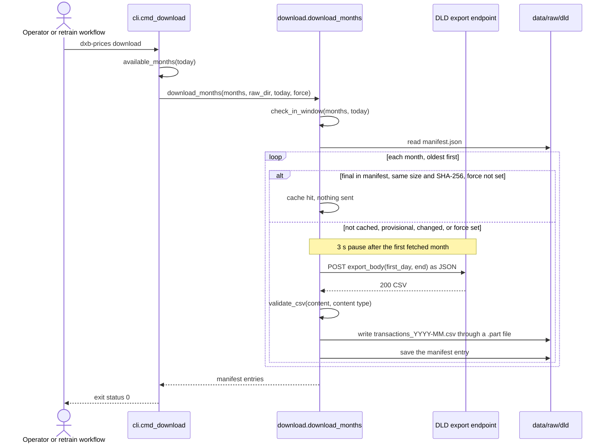

**Happy path, data.dubai sample** (`dxb-prices download --source
dubai-data-sample`, used to check the Dubai Pulse layout; external actor: the
data.dubai download endpoint).

1. `cmd_download` calls `download.download_dubai_data_sample()` with its
   default folder, `$DXB_DATA_DIR/raw/dubai_data` (`--raw-dir`, `--months`,
   `--include-partial` and `--force` do not apply to this source).
2. It sends one `GET` to `DUBAI_DATA_DOWNLOAD_URL` with
   `Accept: application/json` and the project's User-Agent (timeout 120 s). There
   is no cache, no retry and no pause: every run fetches the sample again.
3. A 200 response is parsed as JSON; `success` must be true and `data` a
   non-empty list of rows.
4. The rows are written as CSV with the first row's keys as the header
   (`csv.DictWriter`; keys of later rows that are not in that header are
   dropped) to `real_estate_transactions_sample.csv` through a `.part` file.
5. A `ManifestEntry` (source `data.dubai-public-sample`, period from the
   smallest and largest `instance_date`, bytes, SHA-256, rows, `final` true) is
   saved in that folder's own `manifest.json`, and "downloaded
   real_estate_transactions_sample.csv: N rows, N bytes, sha256 ..." is logged.
6. The command exits 0. `python scripts/data_audit.py --dubai-data-sample`
   then reports the file's rows, detected layout and years, and what the schema
   adapter and the cleaning rules make of it (section 4.15).

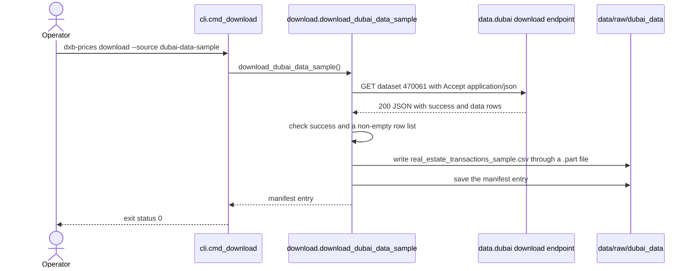

**Failure and error paths.**

| What goes wrong | Detected in | What the system does | State left behind | Recovery |
|---|---|---|---|---|
| Malformed month argument (`--months 2026-13`, `--months March`) | `download.Month.parse` | `MonthError`; exit 1 with "month out of range in '2026-13'" or "expected a month as YYYY-MM, got 'March'" | Nothing fetched | Give months as `YYYY-MM` |
| A month outside the current year, or in the future | `download.check_in_window`, before any request | `MonthError`; exit 1 with "2025-12 is outside 2026: the DLD open data page only offers dates in the current calendar year, so this tool does not request others" or "... is in the future" | Nothing fetched | Ask only for months of the current year up to now |
| January: no complete month yet | `cli.cmd_download` | Prints "No complete month of 2027 is available yet, so there is nothing to download. Use --include-partial to fetch the current month so far."; exit 0, so a scheduled run carries on to `check-data` | Nothing created | None needed |
| Network error or timeout | `download._post_with_retries` | Retries after 5 s and 10 s, logging "attempt 1/3 failed (...); retrying in 5s"; then `DownloadError`, exit 1 with "export request failed after 3 attempt(s): network error: ..." | Months fetched earlier in the run are saved with their manifest entries; the failing month and later ones are not written | Run again; final cached months are skipped |
| HTTP 429, 500, 502, 503 or 504 | `download._post_with_retries` | Same retries; then exit 1 with "export request failed after 3 attempt(s): HTTP 503" | As above | Run again later |
| Any other HTTP status, for example 403 or 404 | `download._post_with_retries` | No retry; exit 1 with "export request failed after 1 attempt(s): HTTP 403" | As above | Check the DLD page. If the endpoint changed, save the month by hand as `data/raw/dld/transactions_YYYY-MM.csv` ([decision 1](docs/decisions.md#1-data-comes-from-the-dld-open-data-export-one-month-at-a-time)) |
| An HTML page instead of CSV (challenge or maintenance page) | `download.validate_csv` | Exit 1 with "the portal returned an HTML page instead of CSV; it may be showing a challenge or maintenance page. Download the month by hand from https://dubailand.gov.ae/en/open-data/real-estate-data/ and save it under data/raw/dld/ with the name transactions_YYYY-MM.csv" | That month not written | Retry later, or save the month by hand |
| A body that is not a UTF-8 CSV | `download._count_csv_rows` | Exit 1 with "the portal returned something that is not a UTF-8 CSV (...). Download the month by hand ..." | That month not written | As above |
| The export changed its columns | `download.validate_csv` | Exit 1 with "CSV is missing expected columns: [...]" | That month not written | Update `schema.EXPORT_COLUMNS` and the maps in `schema.py`, or save by hand |
| A cached file was edited, truncated or replaced | `download._is_fresh` | Size or SHA-256 mismatch, so the month is fetched again; no error | File and manifest entry replaced | None needed |
| Two `download` runs on one cache at the same time | Not detected: there is no lock | Each run rewrites `manifest.json` from its own copy, so one run's entries can be lost | Files without manifest entries | Run `download` again: a file without an entry is fetched again. `retrain.yml` avoids the case with `concurrency: retrain` and an empty cache |
| Disk full or no write permission | `_write_atomic`, `Manifest.save` | `OSError`, not wrapped: Python traceback, exit 1 | Possibly a `.part` file | Free space or fix permissions; run again |
| A corrupt or hand-edited `manifest.json` | `download.Manifest.__init__`, before any request | Not wrapped: `json.JSONDecodeError` for invalid JSON, or `TypeError` for an entry with missing or unknown keys; traceback, exit 1 | Nothing fetched; the cached CSVs are untouched | Restore the file, or delete it: every month without an entry is then fetched again |
| data.dubai sample: HTTP error or no rows (`--source dubai-data-sample`) | `download.download_dubai_data_sample` | Exit 1 with "data.dubai returned HTTP 503" or "data.dubai returned no rows: ..." | Nothing written | Retry later |
| data.dubai sample: network error or a body that is not JSON | `download.download_dubai_data_sample` | Not wrapped: traceback, exit 1 | Nothing written | Retry later |
| data.dubai sample: its folder's `manifest.json` is corrupt | `download.Manifest.__init__`, read after the CSV is written | Not wrapped: traceback, exit 1 | The new sample CSV without a manifest entry | Delete `data/raw/dubai_data/manifest.json` and run again |

Security: the source is public and needs no credentials. Responses are
untrusted input; they are only checked, hashed and stored, and later read as
text (section 5.2).

### 5.2 Train and evaluate

**Trigger and actors.** A person runs `dxb-prices train` (the published run
used the `dev` container), or the retraining workflow does. `train-fixture`
runs the same pipeline on the synthetic fixture with `fixture.SETTINGS`,
without search, reports or tracking.

**Preconditions.** `uv sync --all-extras` (the `train` extra); at least four
distinct months in the cached CSVs; ideally a final newest month (only
`check-data` checks this); a writable MLflow store unless `--no-tracking`.

**Happy path.**

1. `cmd_train` lists `transactions_*.csv` in `--raw-dir`.
2. `pipeline.load_and_clean`: `schema.read_raw_csvs`, `schema.to_canonical`
   (price-per-area columns dropped), `clean.clean` with the eleven counted
   steps; it returns the cleaned sales, the `CleaningReport` and the raw row
   count.
3. `cli.data_info` re-hashes every raw file and takes its period, rows and
   download time from the manifest; a file missing from the manifest, or whose
   hash differs, is listed as "not in manifest".
4. `train_and_evaluate`: `split.plan` makes the newest month the test month and
   the one before it the validation month; `split.apply` slices the rows.
5. With tracking, `tracking.run` opens the MLflow run `train-<test month>` in
   experiment `dxb-prices`.
6. `_select`: `split.trim_training` and `features.fit` on the training months.
   `_search` trains the full model for each of the 12 settings in
   `SEARCH_SPACE` (or the defaults with `--no-search`), with early stopping on
   the validation month, scores each on that month and logs it as a nested run
   `search-NN`; the lowest validation MdAPE wins. The community-level model is
   trained with the chosen settings and its own early stopping. Both baselines
   are fitted. `score_period(valid)` scores the validation month as served and
   gives the validation scores and each model's residual quantiles (q10, q90).
7. `_refit_and_test`: trim and fit features again on the training and
   validation months, train both models with the chosen numbers of rounds, and
   refit the baselines. `score_period(test)` turns each test sale into the
   request a user would send, with and without its project, routes it through
   `serving.model_rows` and `serving.estimate`, and adds the recorded-labels
   reference and both baselines. It computes the five estimators' scores, the
   80% range coverage and the segment tables.
8. `backtest` (unless `--no-backtest`): for every month from the fourth, train
   with default settings on the months before the previous month, stop early
   on the previous month, refit on all earlier months, and score the month.
9. `cold_start` (unless `--no-cold-start`): split the test month's communities
   into five random groups; for 0 and 10 kept training sales, refit both models
   and both baselines with each group's communities cut, and score that
   group's test sales (ten refits).
10. `_results` assembles the results; `_model_metadata` adds the model version
    (`<test month>-<UTC timestamp>`), each model's base price per square metre
    (the exponential of the TreeSHAP bias), the community medians, the test
    scores, the thin-community threshold and the settings.
11. `PriceModel.save` writes `model.lgb`, `model_community.lgb`,
    `features.json` and `metadata.json`.
12. `_write_reports`: SHAP importance on up to 5,000 served test sales routed
    to the full model, `shap_importance.png`, the Evidently drift report
    (`reports/drift/drift_<newest month>.html`), then `metrics.json` and
    `metrics.md`.
13. `_log_to_mlflow` logs the parameters, the flattened metrics and the `model`
    and `reports` artefacts; the MLflow run closes.
14. `cmd_train` prints `{"test": {...}, "model_dir": "..."}` and exits 0.

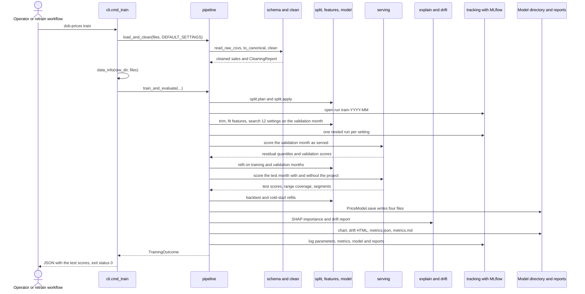

**Failure and error paths.**

| What goes wrong | Detected in | What the system does | State left behind | Recovery |
|---|---|---|---|---|
| No raw files | `schema.read_raw_csvs` | `MissingInputError`; exit 1 with "no raw CSV files found; run `dxb-prices download` first or place DLD exports in data/raw/dld/" | Nothing written | Run `download` |
| Columns of neither known layout | `schema.detect_layout` | `SchemaError`; exit 1 with "unrecognised columns; expected the DLD export (TRANSACTION_NUMBER, TRANS_VALUE, ...) or the Dubai Pulse layout (transaction_id, actual_worth, ...); got [...]" | Nothing written | Replace the file, or update the maps in `schema.py` if DLD changed its export |
| Fewer than four months | `split.plan` | `InsufficientDataError`; exit 1 with "need at least 4 months of data for a temporal split (2 train, 1 validation, 1 test); found 3: [...]" | Nothing written | Wait until May ([decision 1](docs/decisions.md#1-data-comes-from-the-dld-open-data-export-one-month-at-a-time)), or use `train-fixture` |
| The newest month is still provisional | Not checked by `train` | Trains and tests on the incomplete month | A model and report built on an incomplete test month | Run `check-data` first (the workflow does); download again after seven days and retrain |
| The MLflow store cannot be opened (wrong `MLFLOW_TRACKING_URI`, read-only folder) | `tracking.run`, before selection | Exception and traceback, exit 1 | Nothing trained or written | Fix the URI, or pass `--no-tracking` |
| The `train` extra is not installed | `cli.data_info`, which imports `dxb_prices.download` and therefore `httpx`, before training starts | `ModuleNotFoundError: No module named 'httpx'`, traceback, exit 1 | Nothing written, with or without `--no-tracking` | `uv sync --all-extras`, then run again |
| `httpx` is present without the `train` extra (for example only the `ui` extra), or `pipeline.train_and_evaluate` is called directly | Import of `mlflow` in `tracking.run` at the start, or of `shap` (then `evidently`) in `_write_reports` | `ModuleNotFoundError`, traceback, exit 1 | With tracking: nothing written. With `--no-tracking`: the new model directory is written and the reports are not | `uv sync --all-extras`, then run again |
| A corrupt or hand-edited `manifest.json` | `download.Manifest.__init__`, called by `cli.data_info` after cleaning | Not wrapped: `json.JSONDecodeError` or `TypeError`, traceback, exit 1 | Nothing written | Restore the file, or delete it and run `download` again (training without a manifest works, but every file is then listed as "not in manifest" in the report's data snapshot table) |
| Failure while saving the model (disk full, interruption) | `PriceModel.save` | Exception, traceback, exit 1 | The four files are overwritten in place one at a time, so the directory can mix old and new files; nothing checks that they belong together | Run `train` again. A running API keeps the model it loaded at start-up until it restarts |
| Failure after the model is saved (SHAP, drift, MLflow logging) | `_write_reports`, `_log_to_mlflow` | Exception, traceback, exit 1; with tracking on, MLflow records the run as failed | New model directory; reports may be old or partly new (the chart and the drift HTML are written before `metrics.json` and `metrics.md`) | Fix the cause and run again |
| Two `train` runs with the same `--model-dir` or `--reports-dir` | Not detected: there is no lock | Both write the same files; the last write of each file wins | A directory that can mix two runs | Run one training at a time |
| A run longer than the workflow's 90-minute limit | GitHub Actions `timeout-minutes` | Job cancelled | Nothing uploaded | Dispatch with `search` false; locally, `--no-backtest` and `--no-cold-start` also shorten a run |
| Tampered or malformed values in a CSV | `schema.read_raw_csvs` reads every value as text; `to_canonical` coerces with `errors="coerce"` | Unparseable values become missing; Parse and the validity rules drop the rows and count them | Counts visible in the cleaning table | None needed; values are never executed or used in paths |
| `train-fixture`: the `--fixture` path does not exist | `pd.read_csv` in `schema.read_raw_csvs`, which checks only for an empty file list | pandas raises the built-in `FileNotFoundError` ("No such file or directory"), not `MissingInputError`: traceback, exit 1 | Nothing written | Give an existing path, or omit `--fixture` to use `tests/fixtures/transactions_synthetic.csv` (regenerated by `python scripts/make_fixture.py`) |
| `train-fixture`: a fixture with fewer than four months or of an unknown layout; a model directory that cannot be written | `split.plan`, `schema.detect_layout`; `PriceModel.save` | As for `train`: one line and exit 1 for `InsufficientDataError` and `SchemaError`; `OSError` with a traceback for the disk | Nothing written, or a partly written model directory | Use the committed fixture; fix the path or permissions |

### 5.3 Estimate a price

**Trigger and actors.** An API client (the Streamlit page, `curl`, the `/docs`
page or a script) sends `POST /estimate`.

**Preconditions.** The API started with a loadable model directory; the
client can reach the port (by default only from the same machine).

**Happy path.**

1. FastAPI parses the JSON body into `EstimateRequest`: community and project
   trimmed, rooms normalised, size bounded and finite, date in range, no
   unknown fields.
2. The `estimator(request)` helper returns the loaded `Estimator`.
3. `Estimator.resolve_community` resolves the name through
   `normalise.resolve_name` against `spec.community_names`, so English or
   Arabic spellings in any case match.
4. A community with fewer training sales than `thin_community_rows` (50) gets
   a warning.
5. `_project` resolves the project name, keeps it only if it has training
   sales in that community, and adds warnings for a missing, unknown,
   elsewhere-recorded or rare project.
6. `_date` uses the given date or today, and warns when it is more than three
   months after the newest training month or before the first.
7. A one-row request goes through `serving.model_rows`, which fills the nearest
   metro, mall and landmark and the freehold flag and picks `full` or
   `community`.
8. The chosen model gives the estimate (`PriceModel.predict`), the 80% range
   (`interval`) and the five largest factors plus the rest (`explain`).
9. `EstimateResponse` is built (estimate and range to the nearest AED 1,000,
   price per square metre and base price to the nearest 10, community median
   or `null`, warnings, model version and months) and returned with status 200.

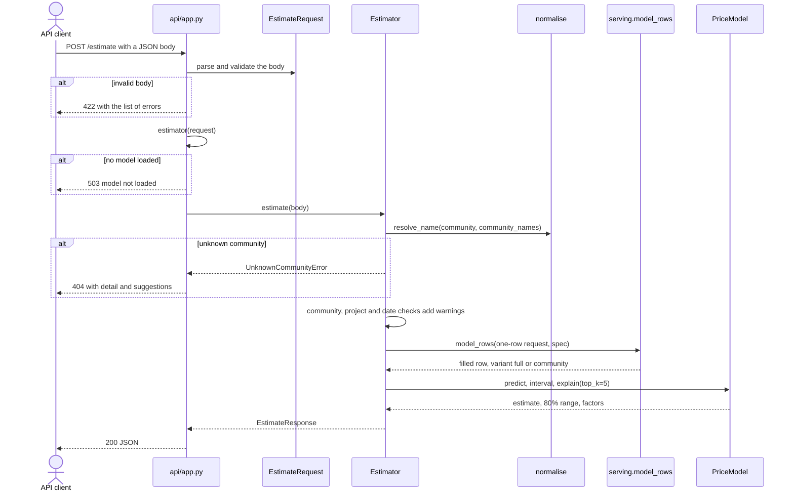

Weak inputs are answered, with a warning in `warnings`:

| Condition | Checked in | Warning (as the code builds it) | Model |
|---|---|---|---|
| No project | `Estimator._project` | "No project given, so the estimate comes from the community-level model, which does not know the building." followed by the test-month note, for the published model " On the 2026-08 test month its median error was 6.5%, against 5.4% with the project." | `community` |
| Project not in the training data | `Estimator._project` | "Project '...' is not in the training data, so the estimate comes from the community-level model, ..." | `community` |
| Project with training sales only in other communities | `FeatureSpec.has_project` | "Project '...' has no training sales in ... (it is recorded in ...), so the estimate comes from the community-level model, ..." | `community` |
| Project with fewer than 40 training sales | `FeatureSpec.project_has_own_level` | "Project '...' has only N training sales, fewer than the 40 the model needs to learn a building on its own, so the estimate draws on its community and location rather than the building." | `full` |
| Community with fewer than 50 training sales | `Estimator.estimate` | "Only N training sales in ...; treat the estimate with extra caution." | Either |
| Date more than three months after the newest training month | `Estimator._date` | "The date is N months after the newest training data; the model does not project market movement." | Either |
| Date before the training period | `Estimator._date` | "The date is before the training period." | Either |

**Failure and error paths.**

| What goes wrong | Detected in | What the system does | State left behind | Recovery |
|---|---|---|---|---|
| No model loaded | `estimator(request)` in `api/app.py` | 503 `{"detail": "model not loaded: <load error>"}` | None (no state changes on any request) | Load a model and restart (section 5.5) |
| Body is not valid JSON | FastAPI request parsing | 422 with an error of type `json_invalid` | None | Send JSON |
| Missing or invalid field: `size_sqm` 5 or 99999, `rooms` "7" or -1, `community` blank, `sub_type` "Villa", `transaction_date` "next week", 1500-01-01 or 9999-12-31, a missing `off_plan` | `EstimateRequest` | 422 `{"detail": [...]}`, each error with `type`, `loc`, `msg` and `input` | None | Fix the field named in `loc` |
| NaN or Infinity as the size (Python's JSON parser accepts these literals) | `EstimateRequest.size_sqm` (`allow_inf_nan=False`); `invalid_request` handler with `json_safe` | 422 saying the number must be finite; the echoed value is turned into text ("nan", "inf") so the response is valid JSON | None | Send a finite number |
| Tampered body with extra fields | `extra="forbid"` | 422 | None | Remove the field |
| Overlong strings | `max_length` 120 (community) and 160 (project) | 422 | None | Shorten the input |
| Unknown community | `Estimator.resolve_community` | 404 `{"detail": "Community 'Busines Bay' is not in the training data.", "suggestions": ["Business Bay", ...]}`, up to five suggestions from `difflib` | None | Use a suggestion, or pick from `GET /communities` |
| An unexpected exception (for example an inconsistent model directory) | Not caught | FastAPI's default 500 response; traceback in the server log | None | Retrain into a clean directory and restart |
| Unauthenticated caller | Nothing checks | Answered: the API has no authentication | None | Keep the port on `127.0.0.1` (section 6.1) |
| Forbidden action | Not applicable | There are no roles and no endpoint writes anything | None | None |
| Names crafted to confuse the lookup (punctuation, mixed scripts, diacritics) | `normalise.key_en` and `key_ar` | Treated as text and matched against in-memory tables; never used in queries, paths or commands | None | None |
| Concurrent requests | Not applicable | The estimator is read-only after start-up; the synchronous endpoint runs in FastAPI's thread pool. The same body gives the same answer, except that a missing date means today | None | None |

### 5.4 List communities and projects

**Trigger and actors.** The Streamlit page (for its pickers) or any client
calls `GET /communities` or `GET /projects?community=...`.

**Preconditions.** A model is loaded.

**Happy path.**

1. `GET /communities`: `Estimator.community_rows` returns every canonical
   community name with its training sales from `spec.community_rows`; the
   endpoint returns `[{"name", "training_sales"}]`.
2. `GET /projects?community=...`: FastAPI checks the query (2 to 120
   characters); the handler trims it and calls `Estimator.projects`.
3. `projects` resolves the community as in 5.3 and returns its entries in
   `spec.project_rows` as `ProjectInfo` objects, sorted by name.

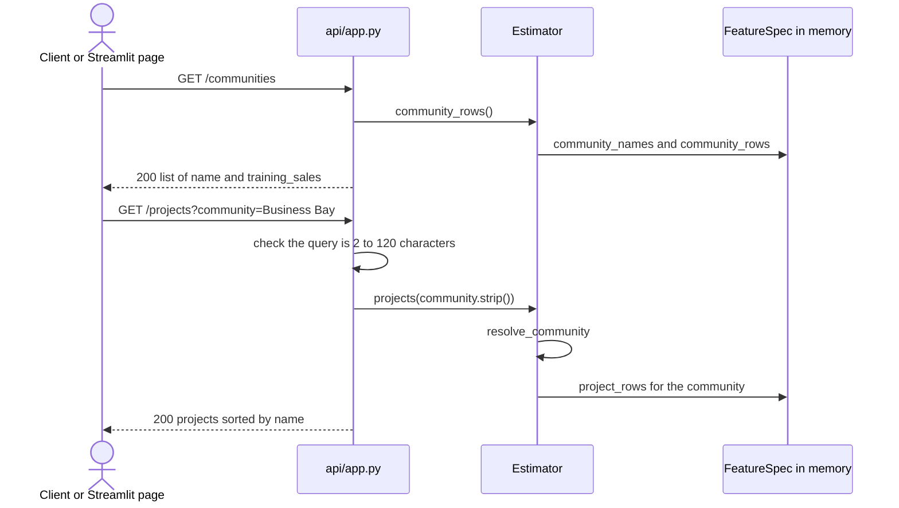

**Failure and error paths.**

| What goes wrong | Detected in | What the system does | State left behind | Recovery |
|---|---|---|---|---|
| No model loaded | `estimator(request)` | 503 `{"detail": "model not loaded: ..."}` | None | Section 5.5 |
| `community` missing, shorter than 2 or longer than 120 characters | FastAPI `Query` validation | 422 | None | Send a valid name |
| Unknown community | `Estimator.resolve_community` | 404 `Problem` with suggestions | None | Use a suggestion |
| Known community with no project names in training | `Estimator.projects` | 200 `[]` | None | Estimate without a project |
| Data exposure: both endpoints serve training sales counts derived from DLD data | By design ([decision 2](docs/decisions.md#2-no-source-data-in-the-repository)) | Served to anyone who can reach the API | None | Keep the API on loopback; decide before any public hosting (section 7.2) |

### 5.5 Service start-up, health and model information

**Trigger and actors.** Docker starts the `api` container (or a person runs
`dxb-prices serve`); Docker's `HEALTHCHECK`, Compose and clients call
`/health` and `/model`.

**Preconditions.** `DXB_MODEL_DIR` (in the image, `/model`) points at a
directory written by `dxb-prices train` or `train-fixture` with this version
of the code.

**Happy path.**

1. uvicorn imports `dxb_prices.api.app`, whose `app = create_app()` takes the
   model directory from `config.MODEL_DIR`.
2. The lifespan handler calls `PriceModel.load`: it checks the four files,
   loads both boosters, rebuilds the `FeatureSpec` (refusing an older layout)
   and reads the metadata.
3. `Estimator(model)` prepares the sorted community list, the community medians,
   the first and last training months, the thin-community threshold and the
   accuracy note for warnings; it is stored in `app.state.estimator`.
   "loaded model ... from ..." is logged at INFO, and appears only when
   logging is configured (for example with `dxb-prices serve`). Under the
   `api` image's plain `uvicorn` command the app's INFO lines are dropped, so
   on success the container log shows only uvicorn's own lines; of the app's
   start-up lines, only the ERROR line "no model loaded: ..." (failure paths
   below) reaches it.
4. `GET /health` returns 200 `{"status": "ok", "model_version": ...}`; the
   image's `HEALTHCHECK` calls it every 15 s, and Compose starts `ui` once it
   passes.
5. `GET /model` returns the model version, training time, target, training and
   test months, data period end and test scores.

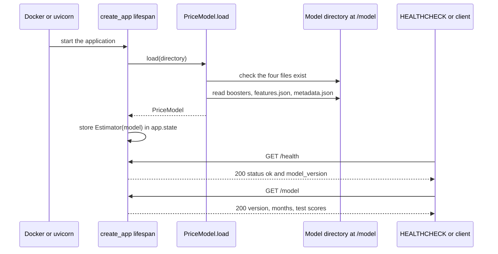

**Failure and error paths.**

| What goes wrong | Detected in | What the system does | State left behind | Recovery |
|---|---|---|---|---|
| Model directory missing, empty or incomplete | `PriceModel.load` (`MissingInputError`, an `OSError`) | Caught: the service starts without a model and logs "no model loaded: ..."; `/health` answers 503 with `status` `unavailable` and a `detail` such as "model directory /model is missing [...]; train one with `dxb-prices train` (real data) or `dxb-prices train-fixture` (synthetic)"; the other endpoints answer 503 | Container unhealthy, so Compose does not start `ui` | Train a model, point `DXB_MODEL_DIR_HOST` at it and run `docker compose up` again |
| A corrupt booster file | `lgb.Booster(model_file=...)` (`LightGBMError`) | Caught; 503 as above with LightGBM's message | As above | Retrain |
| A model directory from an older version | `FeatureSpec.from_dict` (`ValueError`) | Caught; 503 with "the saved feature spec was written by an older version of dxb-prices (its project tables are not keyed by community); train the model again" | As above | Retrain |
| The bind mount cannot be read (seen with Docker Desktop for Windows under `AppData\Roaming`) | `PriceModel.load` (`OSError`) | Caught; 503 with "Input/output error" in the detail | As above | Copy the model to an ordinary folder and point `DXB_MODEL_DIR_HOST` at the copy ([README](README.md#troubleshooting)) |
| Any other exception while loading, for example an `AttributeError` from a `metadata.json` of the wrong shape | Not caught by the lifespan handler | Application start-up fails and uvicorn exits; Compose restarts the container (`restart: unless-stopped`), which fails the same way | Restart loop | Retrain into a clean directory |
| The model files are replaced while the API runs | Not detected | Keeps serving the model loaded at start-up | Old model in memory | `docker compose restart api` |
| `GET /model` or `GET /communities` without a model | `estimator(request)` | 503 `{"detail": "model not loaded: ..."}` | None | As above |

### 5.6 Value an apartment on the Streamlit page

**Trigger and actors.** A person opens the page (in Compose,
`http://127.0.0.1:58001`). The page calls the API.

**Preconditions.** The API is reachable at `DXB_API_URL` and has a model.

**Happy path.**

1. The page loads communities through `load_communities` (cached for 300 s per
   API URL), which calls `ApiClient.communities()` and `GET /communities`.
2. The community picker defaults to Business Bay when it is listed. Outside the
   form, `load_projects` fetches the community's projects (also cached), so
   the project list follows the community.
3. The person chooses a project (or "Not given"), size, rooms, Ready or
   Off-plan, and a date, and presses Estimate.
4. `ApiClient.estimate` posts `{"community", "size_sqm", "rooms", "off_plan",
   "project", "transaction_date"}` to `/estimate`.
5. The page shows the estimate as a metric, the 80% range and price per square
   metre, the community's training median when present, each warning, a factor
   table with the remainder, and a caption naming the model that answered, its
   version and its training months.

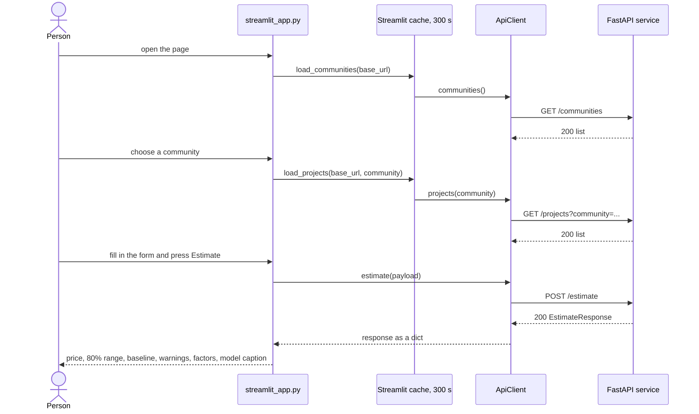

**Failure and error paths.**

| What goes wrong | Detected in | What the system does | State left behind | Recovery |
|---|---|---|---|---|
| The API is not running or not reachable | `ApiClient._get` or `estimate` (`httpx.HTTPError`) | `st.error("cannot reach the API at http://api:8000: ...")`, then the script stops | Nothing cached for the failed call | Start the API; reload the page |
| The API answers 503 (no model) | `ApiClient._get` | "API returned HTTP 503: ..." (first 200 characters of the body) | As above | Section 5.5 |
| The API takes longer than 15 s | `httpx` timeout, an `HTTPError` | Same "cannot reach the API" message | As above | Check the API's load and logs |
| An unexpected response shape | `ApiClient.communities`, `projects` | "unexpected /communities response" or "unexpected /projects response" | As above | Check that the page and API versions match |
| The estimate is rejected with 422 | `ApiClient.estimate` | "invalid input: size_sqm: ..." (field and message per error) | None | The widgets keep inputs in range, so this points to a version mismatch |
| 404 for the community: the model was replaced while the page's cache still lists an old community | `ApiClient._get` (via `load_projects`) or `ApiClient.estimate` | From `load_projects`, which runs before the form on every rerun: `st.error("API returned HTTP 404: ...")` without suggestions, and the script stops. From the estimate, when that community's project list is still cached: `st.error` with the detail and `st.info("Did you mean: ...")` | None | Choose again; the lists refresh within 300 s |
| Lists out of date after a model swap | `st.cache_data(ttl=300)` | Old lists for up to five minutes | Stale cache | Wait, or restart the `ui` service |
| Unauthenticated use | Nothing checks | Anyone who can reach the page can use it | None | Keep `DXB_BIND_ADDRESS=127.0.0.1` |

### 5.7 Monthly retraining

**Trigger and actors.** GitHub's scheduler at 05:00 UTC on the 10th of each
month (`cron: "0 5 10 * *"`), or a person with write access through
`workflow_dispatch` (input `search`, default true). The maintainer reviews the
result. External actor: the DLD export endpoint.

**Preconditions.** The workflow is enabled (GitHub switches off scheduled
workflows in a public repository after 60 days without activity); from May
onwards, at least four complete months exist in the year.

**Happy path** (as written; it has not yet run on GitHub).

1. Job `retrain` starts on `ubuntu-24.04` with `contents: read`, a 90-minute
   limit and the concurrency group `retrain`.
2. It checks out the code, reads the uv version from the Dockerfile, sets up
   uv and Python 3.12, and runs `uv sync --frozen --all-extras`.
3. `uv run dxb-prices download` fetches every complete month of the year into
   an empty cache (on 10 October 2026, January to September: nine requests,
   three seconds apart).
4. `uv run dxb-prices check-data` exits 0 when at least four months are
   present and the newest month is not recorded as provisional in
   `manifest.json` (a month without a manifest entry, such as one saved by
   hand, passes; in the workflow every month comes from `download`, so each has
   an entry), so the step sets `enough=true`. On 10 October 2026
   it would print "ok: 9 months; train 2026-01 to 2026-07, validate 2026-08,
   test 2026-09".
5. `uv run dxb-prices train` runs with the search (or with `--no-search` when
   dispatched with `search` false), the backtest, the cold start and MLflow
   tracking into the runner's `./mlruns`.
6. `reports/metrics.md` is appended to the run summary.
7. `metrics.json`, `metrics.md` and `shap_importance.png` are uploaded as the
   artefact `metrics-report-<run id>`, kept for 90 days.
8. The maintainer compares the report with the published one and decides what
   to do; the workflow deploys and commits nothing.

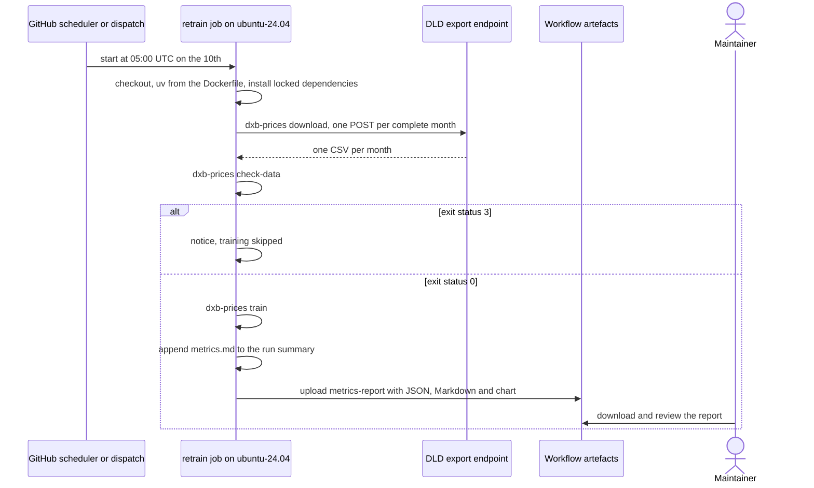

**Failure and error paths.**

| What goes wrong | Detected in | What the system does | State left behind | Recovery |
|---|---|---|---|---|
| January to April: too few complete months | `download` (exit 0 in January), then `check-data` (exit 3) | `enough=false`, notice "Not enough final months this year yet; skipping training."; the job succeeds | No artefact | None; the first retrain of a year runs in May |
| The newest month is provisional (a manual run within seven days of a month's end) | `cli.cmd_check_data` | Exit 3 with "not enough data: the newest month, ..., was downloaded less than 7 days after it ended and may still gain late registrations; run `dxb-prices download` again after that"; training skipped | No artefact | Dispatch again after the seventh day |
| DLD refuses requests from GitHub's runners, or answers with HTML or an error | `download` step (exit 1) | The job fails and GitHub marks the run failed | No artefact | Retry later; if runners are refused, retrain locally. Whether DLD answers GitHub's runners is untested ([README](README.md#limitations-and-roadmap)) |
| `check-data` fails for another reason (exit 1, for example an unexpected file name) | The step's shell script (`exit "$code"`) | The job fails | No artefact | Fix the cause |
| A corrupt or hand-edited `manifest.json` (possible when `check-data` runs on a local cache; the workflow starts from an empty cache that `download` fills) | `download.Manifest.__init__`, called by `cli.cmd_check_data` once a split is possible | Not wrapped: `json.JSONDecodeError` or `TypeError`, traceback, exit 1; in the workflow the step passes the status on and the job fails | No artefact | Restore the file, or delete it and run `download` again |
| Training fails | `train` step | The job fails | No artefact; the runner is discarded | See section 5.2 |
| The run takes more than 90 minutes | `timeout-minutes: 90` | The job is cancelled | No artefact | Dispatch with `search` false |
| A report file is missing at upload | `actions/upload-artifact` (`if-no-files-found: error`) | The step fails | No artefact | Check the training logs |
| Runs overlap (a dispatch during a scheduled run) | `concurrency: retrain`, `cancel-in-progress: false` | The new run waits; if another arrives meanwhile, GitHub cancels the waiting one | None | None needed |
| The schedule was switched off after 60 days without activity | GitHub | No run | None | Re-enable the workflow or dispatch it |
| Security: an attempt to deploy or leak data from the workflow | Workflow design | Read-only token, no secrets, no deployment step; only the metrics report is uploaded ([decision 13](docs/decisions.md#13-retraining-never-deploys)) | None | None |

### 5.8 Continuous integration

**Trigger and actors.** A push to `main` or any pull request (including
Dependabot's). Actors: the author, GitHub Actions.

**Preconditions.** None beyond a GitHub-hosted runner.

**Happy path.**

1. Three jobs start in parallel on `ubuntu-24.04`; each reads the uv version
   from the Dockerfile and sets up uv with caching.
2. `lint`: `uv lock --check`, `uv sync --frozen --all-extras`, `ruff check .`,
   `ruff format --check .`, `mypy` (strict), actionlint 1.7.12.
3. `test` on Python 3.12, 3.13 and 3.14 (`fail-fast: false`): regenerate the
   fixture and require no diff in `tests/fixtures/`; `pytest --cov
   --cov-report=term-missing`.
4. `docker`: `uv sync --frozen --no-dev` (base dependencies only),
   `dxb-prices train-fixture --model-dir artifacts/fixture-model`, build the
   `api` and `ui` images, run the API container with the fixture model mounted
   read-only and 768 MB of memory, poll `/health` for up to 60 s, then check
   that an estimate without a project uses `community` with five factors, that
   `/projects?community=Marsa Dubai` lists Marina Crest, that an estimate with
   Marina Crest uses `full`, and that a bad request gets 422; finally remove
   the container.
5. GitHub reports the checks on the commit or pull request.

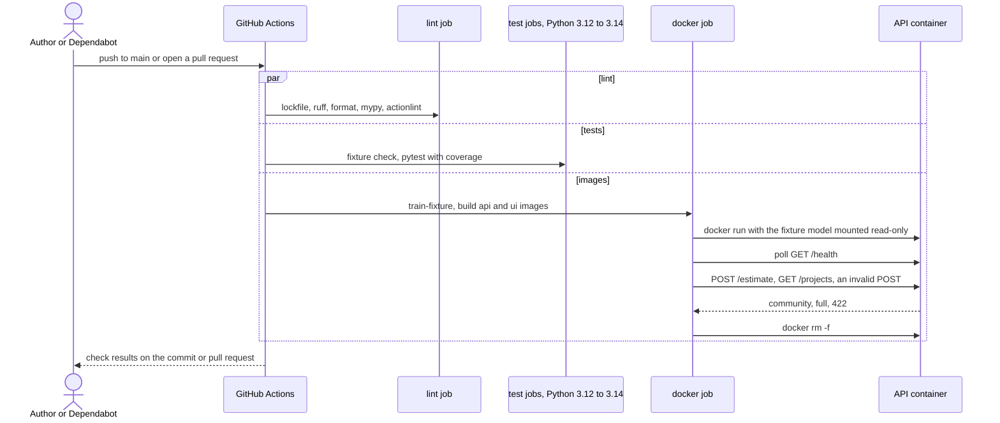

**Failure and error paths.**

| What goes wrong | Detected in | What the system does | State left behind | Recovery |
|---|---|---|---|---|
| The lockfile does not match `pyproject.toml` | `uv lock --check` | `lint` fails | Red check | `uv lock`, commit |
| Lint, format or type errors | ruff, mypy | `lint` fails | Red check | Fix and push |
| Invalid workflow syntax | actionlint | `lint` fails | Red check | Fix the workflow |
| The fixture generator's output changed | `git diff --exit-code tests/fixtures/` | `test` fails | Red check | Commit the regenerated fixture if the change is intended |
| A test fails on one Python version | pytest | That job fails; the others finish | Red check | Fix and push |
| README or model card out of step with `reports/metrics.json` | `tests/test_docs.py` | `test` fails | Red check | Section 5.9 |
| Version pins disagree, or an action is not pinned as required | `tests/test_repo_consistency.py` | `test` fails (on 2 October 2026 this caught Dependabot's uv update, fixed by pull request #3) | Red check | Keep the Dockerfile as the single source |
| The API container never becomes healthy | Health poll loop | Prints `docker logs dxb-prices-api` and fails | Container removed by the `if: always()` step | Read the logs |
| A smoke-test assertion fails | `python3 -c` checks | `docker` fails | Container removed | Fix and push |
| A newer push to the same ref | `concurrency: ci-${{ github.ref }}`, `cancel-in-progress: true` | The older run is cancelled | None | None needed |
| A pull request from a fork | GitHub, `permissions: contents: read` | Runs with a read-only token and no secrets | None | None needed |

### 5.9 Publish results to the documents

**Trigger and actors.** A maintainer, after `dxb-prices train` on real data has
written new reports.

**Preconditions.** `reports/metrics.json` from the run; the model directory
from the same run for the README sample; `README.md` and `docs/model-card.md`
with their markers.

**Happy path.**

1. `dxb-prices render-docs` reads `reports/metrics.json`, rewrites
   `reports/metrics.md`, the README's headline and results blocks and the model
   card's results block, printing each file it updated.
2. `python scripts/readme_sample.py` loads the model in process, posts the
   sample request with and without the project, and rewrites the README's
   sample block without `community_median_per_sqm_aed`.
3. The maintainer re-reads the hand-written findings around the blocks and
   runs `uv run pytest tests/test_docs.py`, which checks that the blocks equal
   what `metrics.json` renders and that each written finding still holds.
4. The maintainer commits; CI runs the same tests.

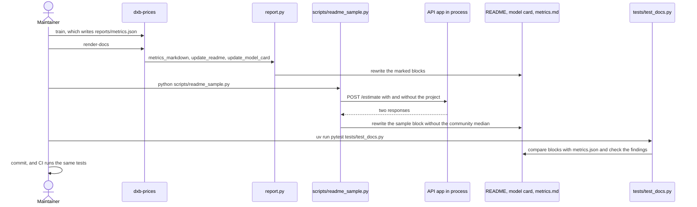

**Failure and error paths.**

| What goes wrong | Detected in | What the system does | State left behind | Recovery |
|---|---|---|---|---|
| No `metrics.json` | `cli.cmd_render_docs` | `MissingInputError`; exit 1 with "... does not exist; run `dxb-prices train` first", naming the `--metrics` path | Nothing changed | Train first |
| The `--readme` or `--model-card` file does not exist | `Path.read_text` in `cli.cmd_render_docs` | Not wrapped: the built-in `FileNotFoundError`, traceback, exit 1 | `metrics.md` already rewritten; the README too if only the model card is missing | Pass the right path; run again |
| A document lost its markers | `report.replace_block` | `ValueError("document has no <!-- results:start --> ... <!-- results:end --> block")`, traceback | `metrics.md` already rewritten; the README too if only the model card failed | Restore the markers; run again |
| No model for the sample, or the sample community is unknown to a new model | `scripts/readme_sample.py` (`raise_for_status` on 503 or 404) | Traceback | README unchanged | Train, or change `REQUEST` in the script |
| The README lost its sample markers | `scripts/readme_sample.py` | Exits with `README.md has no <!-- sample:start --> ... <!-- sample:end --> block` | README unchanged | Restore the markers |
| A written finding is no longer true after a retrain | `tests/test_docs.py` | Tests fail locally and in CI | Red check | Rewrite the finding and its test together |
| `metrics.json` committed without re-rendering | `tests/test_docs.py::test_generated_blocks_match_the_published_metrics` | CI fails | Red check | Run `render-docs` and commit |
| A price statistic of the data would reach the README | By design | The sample drops `community_median_per_sqm_aed`; the report publishes no medians ([decision 2](docs/decisions.md#2-no-source-data-in-the-repository)) | None | None needed |

## 6. Cross-cutting concerns

### 6.1 Security model

The system holds no personal data, no credentials and no secrets; its assets
are the integrity of the estimates, the model directory, the build and the
terms under which the data may be used.

| Concern | Control in place | Gap or note |
|---|---|---|
| Who can call the API and the page | Compose publishes both on `127.0.0.1` by default (`DXB_BIND_ADDRESS`) | No authentication, authorisation, CORS middleware, rate limiting or TLS. `DXB_BIND_ADDRESS=0.0.0.0` exposes an unauthenticated service |
| Malformed or tampered requests | `EstimateRequest` with `extra="forbid"`, bounds, length limits, finite numbers; `json_safe` in the 422 handler | No request body size limit is configured in the code |
| Integrity of the model directory | Mounted read-only into a non-root container (uid 10001); load errors give 503 | No checksum or signature; nothing checks that the four files come from one run |
| Supply chain | `uv.lock` with SHA-256 hashes, installed with `--frozen`; `uv lock --check` in CI; Dependabot weekly; `setup-uv` pinned to a commit and other actions to major tags (`tests/test_repo_consistency.py`); actionlint | Base images are referenced by tag, not digest |
| CI and retraining | `permissions: contents: read`; no secrets; no deployment step | None |
| Outbound requests | A User-Agent that names the project; no `Origin` or `Referer` imitating the DLD page; one request per month, three seconds apart | The endpoint is undocumented and may change |
| Data terms | `data/`, `artifacts/`, `mlruns/`, `mlflow.db` and `reports/drift/` git-ignored; `.dockerignore` keeps data, models and reports out of images; no median prices per community, project or segment published | A running API serves derived values (community medians, training sales counts), which matters only if it is hosted ([decision 2](docs/decisions.md#2-no-source-data-in-the-repository)) |
| Third-party telemetry | `telemetry.opt_out()`; Streamlit usage statistics off in `.streamlit/config.toml` and in the `ui` image's command | `mlflow ui` is started by the user, so the README's command sets the variables itself |

### 6.2 Configuration and secrets

No secrets are needed. Compose reads `.env` (copied from `.env.example`; `.env`
is git-ignored); the Python commands read only their process environment.

| Variable | Default | Read by |
|---|---|---|
| `DXB_DATA_DIR` | `./data` | `config`: raw cache at `$DXB_DATA_DIR/raw/dld` |
| `DXB_ARTIFACTS_DIR` | `./artifacts` | `config`: parent of the model directories |
| `DXB_MODEL_DIR` | `$DXB_ARTIFACTS_DIR/model`; `/model` in the `api` image | `config`: where `train` writes and the API reads |
| `DXB_REPORTS_DIR` | `./reports` | `config` |
| `MLFLOW_TRACKING_URI` | `./mlruns` as a `file:` URI | `tracking.resolve_uri` (also `--tracking-uri`) |
| `MLFLOW_ALLOW_FILE_STORE` | Set to `true` for `file:` URIs | `tracking.resolve_uri` |
| `GIT_PYTHON_REFRESH` | `quiet` unless set | `tracking.resolve_uri` |
| `MLFLOW_DISABLE_TELEMETRY`, `DO_NOT_TRACK`, `EVIDENTLY_DISABLE_TELEMETRY` | `true`, `true`, `1` unless set | `telemetry.opt_out` |
| `DXB_API_URL` | `http://127.0.0.1:8000`; `http://api:8000` in the `ui` image and Compose | `ui/client.py` |
| `DXB_BIND_ADDRESS` | `127.0.0.1` | `compose.yaml` |
| `DXB_API_PORT`, `DXB_UI_PORT` | `58000`, `58001` | `compose.yaml` |
| `DXB_MODEL_DIR_HOST` | `./artifacts/model` | `compose.yaml` |
| `PYTHON_VERSION`, `UV_VERSION` | `3.12`; read from the Dockerfile | `ci.yml`, `retrain.yml` |
| `SEARCH` | `true` for a scheduled run; the `search` input for a dispatched run | `retrain.yml`, step "Train and evaluate": `false` adds `--no-search` |
| `UV_COMPILE_BYTECODE`, `UV_LINK_MODE`, `UV_PROJECT_ENVIRONMENT` | `1`, `copy`, `/opt/venv` | `Dockerfile` stage `base` (so also `dev`, `api-build` and `ui-build`): uv compiles bytecode, copies files and installs into `/opt/venv` |
| `PATH`, `PYTHONDONTWRITEBYTECODE`, `PYTHONUNBUFFERED` | `/opt/venv/bin` first on the path, `1`, `1` | `Dockerfile` stages `base` and `runtime` (so every image) |

Every numeric rule is code, not configuration: `config.Settings` (section 4.1).

### 6.3 Logging and observability

| Area | What exists | Not built |
|---|---|---|
| Command line | `logging` at INFO (DEBUG with `-v`), format `%(asctime)s %(levelname)s %(name)s: %(message)s`; per-month download lines, search trials, backtest and cold-start lines | Structured (JSON) logs |
| API | "no model loaded: ..." (ERROR) at start-up; "loaded model ... from ..." only with `dxb-prices serve` (the container's uvicorn command configures no handler for the app's INFO logs); uvicorn's access and error logs | Request metrics, tracing, alerting; INFO logs from the app in the container |
| Health | `GET /health` (200 or 503) and the image's `HEALTHCHECK`; Compose waits for it before starting `ui` | |
| Model provenance | `model_version` in `/health` and `/model`, and `model.version` in every estimate; training months and data period end | |
| Training runs | MLflow runs with nested search trials; `reports/metrics.json` and `metrics.md`; snapshot checksums | |
| Data and model drift | Evidently drift report each training run; drifted columns listed in `metrics.json` and the model card | Drift on live requests |
| Scheduled runs | Run summary with `metrics.md`; the Actions tab shows failures | Notifications beyond GitHub's defaults |

### 6.4 Performance

- **Serving.** One uvicorn process per container; the synchronous endpoints
  run in FastAPI's thread pool. Each request builds a one-row frame and calls
  the chosen booster three times: for the estimate, for the range and for the
  factors (`pred_contrib`). Compose limits the API to 768 MB and 1 CPU. No
  latency or throughput figures are published yet (NFR-12, planned in
  section 7).
- **Training.** Up to 5,000 boosting rounds, stopping early after 100 rounds
  without improvement; the published run chose 1,635 rounds for the full
  model and 1,543 for the community-level model. A full `train` adds 12
  search trials, one backtest fold per month from the fourth (five in the
  published run) and ten cold-start refits; `--no-search`, `--no-backtest`
  and `--no-cold-start` shorten it, and `retrain.yml` allows 90 minutes.
  `BASE_PARAMS` uses four threads.
- **Download.** One request per month (4 to 7 MB each), three seconds apart,
  with a 180-second read timeout.
- **Page.** Community and project lists are cached for 300 s.

### 6.5 Accessibility and internationalisation

- Community and project names are accepted in English or Arabic, in any case;
  Arabic letter variants, diacritics, tatweel and Arabic-Indic digits are
  normalised (`normalise.key_ar`).
- Responses, warnings and the page are in English only. Amounts are AED with
  thousands separators; dates are ISO 8601.
- The page uses Streamlit's standard labelled widgets; the factor table is a
  plain table. No accessibility audit has been done.
- The SHAP chart uses one colour and prints each value at the bar's end, so it
  does not depend on colour; the README gives it alt text.

## 7. Execution roadmap

### 7.1 Remaining files to be created, in order of implementation priority

Only work the repository itself records as not done: the README's
[Limitations and roadmap](README.md#limitations-and-roadmap), the decision
records' stated next steps, and pending runs. Names marked *proposed* do not
exist yet. "D1" to "D7" are the decisions in 7.2.

| Priority | File | Purpose | Depends on | Acceptance criteria | Size |
|---|---|---|---|---|---|
| 1 | `README.md` (existing; "Limitations and roadmap", bullet "Not yet run on GitHub") | Record that CI runs on GitHub (passing on `main` since 3 October 2026) and the outcome of the first `retrain.yml` run, including whether the DLD export answered GitHub's runners | The first retrain run (scheduled 10 October 2026, 05:00 UTC, or dispatched by hand); D6 | The bullet gives each workflow's first run date and result; if the download was refused, it says so and keeps the manual route; `tests/test_docs.py` passes | S |
| 2 | `scripts/benchmark_api.py` (proposed) | Measure `POST /estimate` latency and throughput against the `api` container with Compose's limits (768 MB, 1 CPU), with and without a project | A trained model; Docker; a quiet machine | Records the machine, image ID, limits, request count and mix; repeatable from one command; no DLD values in its output | M |
| 3 | `reports/performance.md` (proposed) and `README.md` (existing) | Publish the measured figures and replace the README's "No performance or latency figures are published yet" | 2 | Median and 95th-percentile latency and requests per second for both request types, with the conditions of the run; the README links to it | S |
| 4 | `src/dxb_prices/pipeline.py` (existing; `_search`) and `tests/test_pipeline.py` (existing) | Score each search setting on served validation rows instead of DLD's recorded labels, the closer match that [decision 4](docs/decisions.md#4-temporal-split-selection-on-validation-one-look-at-the-test-month) names | None | Each trial is scored on the validation month's served rows (`serving.model_rows` with the project) that are routed to the full model (`variant == full`), because the community-level model is trained only after the search; the chosen trial's score equals the full-model part of the served validation score, which a test pins; decision 4 in `docs/decisions.md` updated | S |
| 5 | `src/dxb_prices/fallback.py` (proposed) | The rule that answers with the project or community median, or a blend, where the model knows little (projects grouped as other, new projects, thin communities), as the README and [decision 18](docs/decisions.md#18-error-analysis-for-new-buildings-and-thin-communities) propose | 4 (recommended); D2 | Rule parameters come only from the validation month's served rows; JSON-serialisable for `metadata.json`; deterministic | M |
| 6 | `tests/test_fallback.py` (proposed) | Unit tests for the rule | 5 | Covers each segment, the plain-model path, a round trip through JSON, and that test-month rows cannot change the rule | S |
| 7 | `src/dxb_prices/pipeline.py` (existing) | Fit the rule in `_select`; apply it in `score_period`, the backtest and the cold start; report it as a new estimator; persist it and the project medians it needs | 5, 6; D2 | The report shows the served-with-fallback row next to the current ones, overall and per segment, whatever the result; `tests/test_pipeline.py` extended | M |
| 8 | `src/dxb_prices/api/estimator.py` and `src/dxb_prices/api/schemas.py` (existing) | Apply the same rule when serving and say in the response which estimator answered, with a warning; adjust the page's caption in `src/dxb_prices/ui/streamlit_app.py` | 7; D2 | `tests/test_api.py::test_the_api_answers_what_the_evaluation_scores` covers the fallback path; the OpenAPI schema documents the new value; `tests/test_ui.py` passes | M |
| 9 | `docs/decisions.md` (existing; new decision 19), `docs/model-card.md` (existing) | Record the fallback decision; update the limitations "Little data, weak estimates" and "The gain comes from buildings the model knows well" | 7, 8; a retrain on real data | `render-docs` and `scripts/readme_sample.py` re-run; `tests/test_docs.py` updated for the new statements and passing | S |
| 10 | `src/dxb_prices/model.py` and `src/dxb_prices/pipeline.py` (existing) | 80% ranges that depend on segments known before a sale (for example off-plan or ready, estimated price band), from residuals per segment or LightGBM quantile models, chosen on the validation month (README "Harder segments", [decision 10](docs/decisions.md#10-each-models-80-range-comes-from-its-validation-residuals)) | D7 | Coverage per segment reported in `metrics.json`; ranges use validation rows only; the response format is unchanged; decision 10 updated; `tests/test_model.py` extended | L |
| 11 | `src/dxb_prices/download.py`, `src/dxb_prices/config.py`, `src/dxb_prices/cli.py` and `.env.example` (existing) | A data.dubai API source for the full history (README "Short history, and a snapshot that expires"), with the key read from an environment variable | D3 | `dxb-prices download` gains the source with the same manifest; the existing `dubai_data` layout in `schema.py` reads it; mocked-transport tests; the key never appears in the manifest, logs or reports; `docs/data.md` and decision 1 updated | L |

### 7.2 Decisions for Farah (not files)

| ID | Decision | Why it is open |
|---|---|---|
| D1 | How a reviewed retrain reaches a running API | `retrain.yml` uploads only the metrics report and models are never committed, so the model a workflow run trained is discarded with the runner; today a new model is trained again locally and its directory mounted into the API. Uploading the model as an artefact would make derived values downloadable ([decision 2](docs/decisions.md#2-no-source-data-in-the-repository)) |
| D2 | Whether the fallback may store and serve project medians, and how a response names the estimator that answered | Project medians are price statistics of the data; the model directory currently holds only community medians |
| D3 | Whether to apply for a data.dubai API key and accept its licence | The full table needs an approved key; adapted data must be shared under the same licence ([docs/data.md](docs/data.md#dubai-data-open-data-licence)) |
| D4 | What the README headline shows after 31 December 2026 | The 2026 snapshot cannot be downloaded again with this tool after that date, and retraining resumes only in May 2027 |
| D5 | Whether to host the API and page publicly | That would need authentication or rate limiting, TLS, and a view on serving derived values under the DLD terms; today both are bound to `127.0.0.1` |
| D6 | Who keeps the monthly schedule alive | GitHub switches off scheduled workflows in a public repository after 60 days without activity |
| D7 | Which segments the range work must cover, and what coverage counts as good enough | In the published run the 80% range with the project contained 63.5% of test prices for ready units and 58.0% in the top estimated price band ([model card](docs/model-card.md#results)) |
