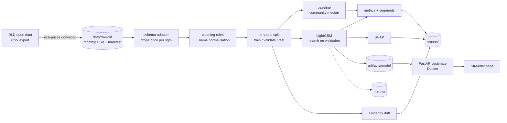

# dxb-prices

Estimates the sale price of a Dubai apartment from Dubai Land Department open
data, and shows the factors behind each estimate.

[](https://github.com/fasharif/dxb-prices/actions/workflows/ci.yml)

## Results

<!-- results:start -->
Data: DLD open data transaction export, sales registered 2026-01-01 to 2026-08-31, downloaded 2026-09-25 (UTC) (147,845 raw rows in 8 monthly files).

| Period | Estimator | Rows | MdAPE | Within 10% | MAE (AED) |
|---|---|---:|---:|---:|---:|
| Validation (2026-07) | LightGBM | 11,274 | 5.4% | 67.9% | 249,522 |
| Validation (2026-07) | Community median baseline | 11,274 | 11.9% | 44.5% | 353,510 |
| Test (2026-08) | LightGBM | 9,480 | 5.3% | 70.4% | 220,774 |
| Test (2026-08) | Community median baseline | 9,480 | 10.9% | 46.9% | 344,661 |

The model beats the baseline on all three test metrics. The 80% estimate range covered 82.7% of test prices.

Environment: Python 3.12.14, LightGBM 4.7.0. Reproduce with `dxb-prices train`; full breakdown in [reports/metrics.md](reports/metrics.md).
<!-- results:end -->

A real response from the API, using the model trained in that run:

<!-- sample:start -->
Request, `POST /estimate`:

```json
{"community": "Business Bay", "size_sqm": 75, "rooms": "1", "off_plan": false, "transaction_date": "2026-08-15"}
```

Response:

```json
{
    "estimate_aed": 1355000,
    "estimate_per_sqm_aed": 18060,
    "range_80_aed": {
        "low": 1174000,
        "high": 1603000
    },
    "community": "Business Bay",
    "project": null,
    "top_factors": [
        {
            "feature": "community",
            "label": "Community",
            "value": "Business Bay",
            "effect_pct": 26.1
        },
        {
            "feature": "project",
            "label": "Project",
            "value": "not given (treated as a less common project)",
            "effect_pct": -10.2
        },
        {
            "feature": "is_off_plan",
            "label": "Off-plan",
            "value": "no",
            "effect_pct": -9.9
        },
        {
            "feature": "area_sqm",
            "label": "Size",
            "value": "75.0 sqm",
            "effect_pct": -4.2
        },
        {
            "feature": "nearest_landmark",
            "label": "Nearest landmark",
            "value": "Downtown Dubai",
            "effect_pct": -2.6
        }
    ],
    "base_per_sqm_aed": 19120,
    "community_median_per_sqm_aed": 26320,
    "warnings": [],
    "model": {
        "version": "2026-08-20260925233137",
        "trained_on_months": [
            "2026-01",
            "2026-02",
            "2026-03",
            "2026-04",
            "2026-05",
            "2026-06",
            "2026-07"
        ],
        "data_period_end": "2026-08-31"
    }
}
```
<!-- sample:end -->

What drives the estimates over the whole test month (mean absolute SHAP value per feature; community and project matter most):


## The problem

Buyers, sellers and agents in Dubai quote prices per square foot for a whole
area, which hides the differences between buildings, sizes and off-plan versus
ready units. DLD publishes every registered sale, but as raw monthly records.
This project turns those records into a tested price model with an honest
evaluation: trained on older months, judged on the newest month, and compared
with the simple rule of thumb it has to beat.

## Features

- **Download with a cache.** One request per month to the DLD open data CSV
  export, with a manifest of sizes and SHA-256 checksums
  ([data sources and terms](docs/data.md)).
- **Documented cleaning.** Sales only, apartments only, duplicates and
  multi-unit deals removed, fixed validity rules, English and Arabic name
  normalisation. Every step reports how many rows it removed.
- **Leak-free evaluation.** Temporal split (train, validate, test by month),
  no future information in the features, and price-per-metre columns (present
  in the Dubai Pulse layout) dropped on read.
- **Baseline.** The community's median price per square metre from the
  training months, times the size.
- **LightGBM model** on log price per square metre, with a small search over
  loss, tree size and leaf size, scored on the validation month.
- **Metrics that matter for pricing:** median absolute percentage error, share
  of estimates within 10%, and mean absolute error, overall and by off-plan or
  ready, price band, rooms and how much data a community has.
- **Explanations.** SHAP values for every estimate (top five factors) and a
  global importance chart.
- **Tracking and monitoring.** MLflow runs in a local file store; an Evidently
  drift report compares the newest month with the training months.
- **Serving.** FastAPI `POST /estimate` with pydantic validation, in Docker; a
  Streamlit page that calls it.
- **Automation.** CI for lint, types, tests and a Docker smoke test; a monthly
  retraining workflow that uploads the metrics report and never deploys.

## Architecture



The package is `src/dxb_prices`. Each stage is a small module with its own
tests; `pipeline.py` wires them together and `cli.py` exposes them as
`dxb-prices <command>`.

## Tech stack and why

| Tool | Why |
|---|---|
| Python 3.12, pandas | The standard for tabular data work; 3.12 is what CI and the images run. |
| LightGBM | Fast gradient boosting with native categorical splits, which suits many communities and projects without target encoding. |
| SHAP (TreeSHAP) | Exact, additive per-estimate explanations for tree models; LightGBM computes them itself, so the API image does not need the `shap` package. |
| MLflow | Records every search trial and the final run's parameters, metrics and artefacts in a plain local directory. |
| Evidently | Ready-made statistical drift tests with an HTML report. |
| FastAPI and pydantic | Typed request validation and OpenAPI docs with little code. |
| Streamlit | A usable form in one file, testable with `AppTest`. |
| uv | One lockfile for every platform, fast installs in CI and Docker. |
| Docker Compose | The API and page run the same way on any machine. |
| ruff, mypy (strict), pytest | Lint, type-check and test on every push. |

## Quick start

Needs Python 3.12, [uv](https://docs.astral.sh/uv/) and Docker.

```bash
git clone https://github.com/fasharif/dxb-prices.git && cd dxb-prices
uv sync --all-extras
uv run dxb-prices download        # this year's complete months, 4 to 7 MB of CSV each
uv run dxb-prices train           # clean, search, evaluate, explain, report
docker compose up --build         # API on :58000 (docs at /docs), page on :58001
```

No time to download? `uv run dxb-prices train-fixture` trains a small model on
the synthetic test data; start Compose with
`DXB_MODEL_DIR_HOST=./artifacts/fixture-model`. Its estimates are meaningless
but the whole path works.

On Windows, a repository in a deep folder can exceed the path limit for
compiled packages. The `dev` image avoids that:
`docker build --target dev -t dxb-prices-dev .` then run any command with
`docker run --rm -v "$PWD:/app" -w /app dxb-prices-dev uv run --frozen --all-extras <command>`.

### Commands

| Command | What it does |
|---|---|
| `dxb-prices download [--months 2026-03 ...] [--force]` | Fetch monthly exports into the cache; `--source dubai-data-sample` fetches the data.dubai sample instead. |
| `dxb-prices check-data` | Exit 0 if there are enough months for a temporal split, 3 if not. |
| `dxb-prices train [--no-search] [--no-tracking]` | Full training and evaluation; writes `artifacts/model/` and `reports/`. |
| `dxb-prices train-fixture` | Small model on the synthetic fixture. |
| `dxb-prices render-docs` | Re-render `reports/metrics.md` and the results blocks in this README and the model card from `reports/metrics.json`. |
| `dxb-prices serve` | Run the API without Docker on port 8000. |
| `MLFLOW_ALLOW_FILE_STORE=true uv run mlflow ui --backend-store-uri ./mlruns` | Browse the tracked runs. |

### API

`POST /estimate`

```json
{"community": "Marsa Dubai", "size_sqm": 80, "rooms": "1", "off_plan": false,
 "project": null, "transaction_date": "2026-09-01"}
```

`community` accepts DLD area names in English or Arabic, in any case. `rooms`
is `studio`, `1` to `4`, `5+` or `penthouse`. Unknown communities return 404
with suggestions; invalid input returns 422. Also `GET /health`, `GET /model`
and `GET /communities`. Interactive docs at `/docs`.

## Configuration

Copy `.env.example` to `.env` to change any of these.

| Variable | Default | Used by |
|---|---|---|
| `DXB_API_PORT`, `DXB_UI_PORT` | `58000`, `58001` | Compose host ports |
| `DXB_MODEL_DIR_HOST` | `./artifacts/model` | Model directory mounted into the API container |
| `DXB_DATA_DIR` | `./data` | Raw download cache |
| `DXB_MODEL_DIR` | `./artifacts/model` | Where `train` writes and the API reads the model |
| `DXB_REPORTS_DIR` | `./reports` | Metrics, SHAP chart, drift report |
| `MLFLOW_TRACKING_URI` | `./mlruns` (file store) | MLflow; `sqlite:///mlflow.db` also works |
| `DXB_API_URL` | `http://127.0.0.1:8000` | Streamlit page outside Docker |

No secrets are needed. MLflow and Evidently usage telemetry and Streamlit
usage statistics are switched off by the code and `.streamlit/config.toml`.

## Tests

```bash
uv run pytest               # unit and integration tests
uv run ruff check . && uv run ruff format --check .
uv run mypy                 # strict
```

The tests use a synthetic fixture (`tests/fixtures/transactions_synthetic.csv`,
generated by `scripts/make_fixture.py`) and a small model trained on it. They
cover the downloader against a mocked HTTP server (cache, checksums, retries,
HTML error pages), each cleaning rule, name normalisation in both languages,
feature fitting on training rows only, the temporal split, the baseline, the
metrics, SHAP additivity and agreement with the `shap` library, the full
pipeline with MLflow and Evidently, the API (validation, suggestions,
warnings) and the Streamlit page against a live API.

## Folder structure

```text
src/dxb_prices/
  download.py       DLD export client, cache and manifest
  schema.py         source layouts -> canonical columns; drops price per sqm
  normalise.py      English and Arabic name keys and merging
  clean.py          cleaning rules and the step report
  split.py          temporal split and training-only trimming
  features.py       feature fitting and transformation
  baseline.py       community median price per sqm
  model.py          LightGBM training, persistence, TreeSHAP factors
  pipeline.py       selection, refit, test scoring, reports
  metrics.py        MdAPE, within 10%, MAE, segment tables
  explain.py        global SHAP summary and chart
  drift.py          Evidently drift report
  tracking.py       MLflow helpers
  report.py         Markdown rendering of results
  cli.py            dxb-prices command
  fixture.py        synthetic data generator
  api/              FastAPI app, schemas, estimator
  ui/               Streamlit page and API client
tests/              pytest suite and the synthetic fixture
reports/            results of the published run (metrics, SHAP chart)
docs/               data and terms, model card, design decisions
scripts/            fixture generator, data audit
.github/workflows/  ci.yml, retrain.yml
```

## Design decisions

See [docs/decisions.md](docs/decisions.md). In short: data comes from the DLD
export month by month and is never committed; the model predicts log price per
square metre; selection uses the validation month and the test month is
scored once; evaluation rows are not trimmed; high-cardinality fields use
LightGBM categoricals with a minimum count; the API explains estimates with
LightGBM's own TreeSHAP. The [model card](docs/model-card.md) covers intended
use and limitations.

## Limitations and roadmap

- **Short history.** The DLD page offers only the current calendar year, so the
  model sees at most eleven months, and from January to March there is too
  little data to retrain. A data.dubai API key would give the full history;
  that route is not built.
- **Harder segments.** Errors are larger for sales above AED 5 million, for
  ready (resale) units and for the few sales in communities with no training
  history, and the 80% range has the same relative width for every estimate
  (see the model card). Segment-aware ranges, for example with quantile
  regression, are the next step.
- **Missing unit details.** Floor, view and condition are not in the open data.
- **Not yet run on GitHub.** The CI and retraining workflows are written and
  linted with actionlint, and every CI command (lint, types, tests, fixture
  check, image builds and the API smoke test) was run locally in the `dev`
  container. Neither workflow has run on GitHub yet; whether the DLD export
  answers requests from GitHub's runners is untested.
- No performance or latency figures are published yet; they need a measured
  run on a quiet machine.

## Data and licence

Source: Dubai Land Department open data
(<https://dubailand.gov.ae/en/open-data/real-estate-data/>). This project is not
affiliated with or endorsed by DLD, Digital Dubai or the Government of Dubai,
and the estimates are not valuations. The data is not included in this
repository; see [docs/data.md](docs/data.md) for the terms of use.

Code: MIT licence, see [LICENSE](LICENSE).
