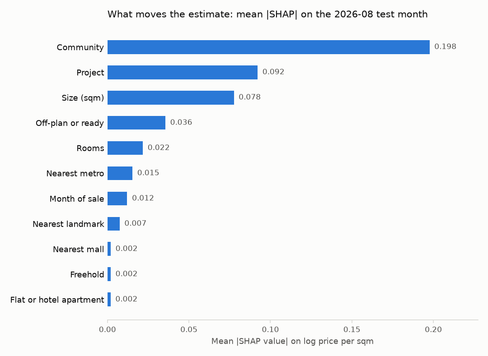
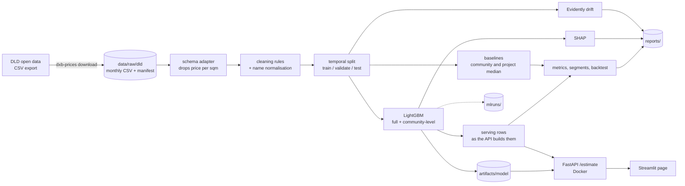

# dxb-prices

Estimates the sale price of a Dubai apartment from Dubai Land Department open
data, and shows the factors behind each estimate.

[](https://github.com/fasharif/dxb-prices/actions/workflows/ci.yml)

## Results

Generated from `reports/metrics.json` by `dxb-prices render-docs`.

<!-- results:start -->
Data: DLD open data transaction export, sales registered 2026-01-01 to 2026-08-31, downloaded 2026-09-25 (UTC) (147,845 raw rows in 8 monthly files).

Test month 2026-08 (9,480 sales, scored once, after the models were refitted on 2026-01 to 2026-07), each sale scored as the API would answer it:

| Estimator | Rows | MdAPE | Within 10% | MAE (AED) | Median error | In 80% range |
|---|---:|---:|---:|---:|---:|---:|
| LightGBM, project given | 9,480 | 5.6% | 69.8% | 209,340 | -0.1% | 79.1% |
| LightGBM, no project (community-level model) | 9,480 | 6.5% | 63.7% | 238,899 | -0.1% | 81.1% |
| Baseline: project median | 9,480 | 7.3% | 61.2% | 241,895 | +1.0% | n/a |
| Baseline: community median | 9,480 | 10.8% | 46.9% | 327,789 | +0.8% | n/a |
| LightGBM with DLD's recorded location labels (reference) | 9,480 | 5.4% | 70.8% | 198,400 | -0.1% | n/a |

*Project given*: the request a user sends (community, project, size, rooms, off-plan or ready, date); the nearest metro, mall and landmark and the freehold flag are filled in from the training data, as the API does. Sales whose project had no training sales (1,193 of 9,480) get the community-level model, as they would from the API. *No project*: the same request without the project, answered by the community-level model, which was trained without the project and the location labels. *Project median*: the project's training median price per sqm when it has at least 5 training sales, otherwise the community's, times the size. *Community median*: the community's training median price per sqm times the size (the baseline the brief asks for). *Recorded location labels*: the full model given DLD's own nearest metro, mall, landmark and freehold flag for each sale, which an API user cannot supply. Median error below zero means estimates run low.

With the project, LightGBM beats both the community-median and the project-median baseline on all three test metrics. Without the project, the community-level model beats the community-median baseline on all three test metrics. Most of the gain over the community median comes from knowing the building: the project median alone moves MdAPE from 10.8% to 7.3%, and the model with the project reaches 5.6%. The 80% range contained 79.1% of test prices with the project and 81.1% without it (80% nominal).

Rolling-origin backtest over 5 test months (2026-04 to 2026-08, default settings, each month scored by models trained only on earlier months): MdAPE 5.4% to 6.9% with the project and 7.0% to 8.2% without it, against 7.0% to 7.6% for the project median and 10.8% to 12.3% for the community median.

The DLD page only offers dates in the current calendar year, so this 2026 snapshot cannot be downloaded again with this tool after 31 December 2026. The file sizes and SHA-256 checksums in [reports/metrics.md](reports/metrics.md) identify it.

Environment: Python 3.12.14, LightGBM 4.7.0. Reproduce with `dxb-prices train`; the validation month, backtest and error analysis are in [reports/metrics.md](reports/metrics.md).
<!-- results:end -->

A real response from the API, using the model trained in that run
(`python scripts/readme_sample.py` regenerates it):

<!-- sample:start -->
Request, `POST /estimate`:

```json
{"community": "Business Bay", "project": "Peninsula Three", "size_sqm": 65, "rooms": "1", "off_plan": false, "transaction_date": "2026-08-15"}
```

Response:

```json
{
  "estimate_aed": 1744000,
  "estimate_per_sqm_aed": 26830,
  "range_80_aed": {
    "low": 1497000,
    "high": 1965000
  },
  "community": "Business Bay",
  "project": "Peninsula Three",
  "model_variant": "full",
  "top_factors": [
    {
      "feature": "community",
      "label": "Community",
      "value": "Business Bay",
      "effect_pct": 35.6
    },
    {
      "feature": "project",
      "label": "Project",
      "value": "Peninsula Three",
      "effect_pct": 12.8
    },
    {
      "feature": "is_off_plan",
      "label": "Off-plan",
      "value": "no",
      "effect_pct": -4.4
    },
    {
      "feature": "month_index",
      "label": "Month of sale",
      "value": "2026-08",
      "effect_pct": -2.2
    },
    {
      "feature": "nearest_landmark",
      "label": "Nearest landmark",
      "value": "Downtown Dubai",
      "effect_pct": -1.4
    }
  ],
  "other_factors_effect_pct": -0.8,
  "base_per_sqm_aed": 19160,
  "community_median_per_sqm_aed": 26320,
  "warnings": [],
  "model": {
    "version": "2026-08-20260926020518",
    "trained_on_months": [
      "2026-01",
      "2026-02",
      "2026-03",
      "2026-04",
      "2026-05",
      "2026-06",
      "2026-07"
    ],
    "data_period_end": "2026-08-31"
  }
}
```

The same request without the project
(`{"community": "Business Bay", "size_sqm": 65, "rooms": "1", "off_plan": false, "transaction_date": "2026-08-15"}`) is answered by the
community-level model: AED 1,359,000, 80% range AED 1,142,000 to 1,636,000, with this warning:

> No project given, so the estimate comes from the community-level model, which does not know the building. On the 2026-08 test month its median error was 6.5%, against 5.6% with the project.
<!-- sample:end -->

What drives the estimates of the model that knows the project (mean absolute
SHAP value per feature on the test month; community and project matter most):



## The problem

Buyers, sellers and agents in Dubai quote prices per square foot for a whole
area, which hides the differences between buildings, sizes and off-plan versus
ready units. DLD publishes every registered sale, but as raw monthly records.
This project turns those records into a tested price model with an honest
evaluation: trained on older months, judged on the newest month the way the API
would answer, and compared with the simple rules of thumb it has to beat.

## Features

- **Download with a cache.** One request per month to the DLD open data CSV
  export, with a manifest of sizes and SHA-256 checksums
  ([data sources and terms](docs/data.md)).
- **Documented cleaning.** Sales only, apartments only, duplicates removed, a
  guard for multi-unit deals, fixed validity rules, English and Arabic name
  normalisation. Every step reports how many rows it removed.
- **Leak-free evaluation.** Temporal split (train, validate, test by month),
  no future information in the features, and price-per-metre columns (present
  in the Dubai Pulse layout) dropped on read.
- **Two models.** A LightGBM model that knows the project (building), and a
  community-level model for requests whose project is not given or not in the
  training data. Both predict log price per square metre.
- **Scored as served.** Each test sale is sent through the same code the API
  uses, with and without its project, so the published accuracy is what a user
  gets.
- **Two baselines.** The community's median price per square metre (the one the
  brief asks for) and the project's median, both from the training months only.
- **Metrics that matter for pricing:** median absolute percentage error, share
  of estimates within 10%, mean absolute error and median signed error, overall
  and by off-plan or ready, price band, rooms and how much data a community has,
  plus a rolling-origin backtest over five months.
- **Explanations.** SHAP values for every estimate (top five factors and the
  combined rest) and a global importance chart.
- **Tracking and monitoring.** MLflow runs in a local file store; an Evidently
  drift report compares the newest month with the training months.
- **Serving.** FastAPI `POST /estimate` and `GET /projects` with pydantic
  validation, in Docker; a Streamlit page that calls it.
- **Automation.** CI for lint, types, tests, the lockfile and a Docker smoke
  test; a monthly retraining workflow that uploads the metrics report and never
  deploys.

## Architecture



The package is `src/dxb_prices`. Each stage is a small module with its own
tests; `pipeline.py` wires them together and `cli.py` exposes them as
`dxb-prices <command>`. `serving.py` builds model rows from a request; the API
and the evaluation both use it.

## Tech stack and why

| Tool | Why |
|---|---|
| Python 3.12, pandas | The standard for tabular data work. Only 3.12 is tested (CI and the images), so `requires-python` is pinned to it. |
| LightGBM | Fast gradient boosting with native categorical splits, which suits many communities and projects without target encoding. |
| SHAP (TreeSHAP) | Exact, additive per-estimate explanations for tree models; LightGBM computes them itself, so the API image does not need the `shap` package. |
| MLflow | Records every search trial and the final run's parameters, metrics and artefacts in a plain local directory. |
| Evidently | Ready-made statistical drift tests with an HTML report. |
| FastAPI and pydantic | Typed request validation and OpenAPI docs with little code. |
| Streamlit | A usable form in one file, testable with `AppTest`. |
| uv | One lockfile for Linux, Windows and Apple-silicon macOS (Intel macOS is left out: numba has no current wheels there); fast installs in CI and Docker. |
| Docker Compose | The API and page run the same way on any machine. |
| ruff, mypy (strict), pytest | Lint, type-check and test on every push. |

## Quick start

Needs Python 3.12, [uv](https://docs.astral.sh/uv/) and Docker.

```bash
git clone https://github.com/fasharif/dxb-prices.git && cd dxb-prices
uv sync --all-extras
uv run dxb-prices download        # this year's complete months, 4 to 7 MB of CSV each
uv run dxb-prices train           # clean, search, evaluate, backtest, explain, report
docker compose up --build         # API on 127.0.0.1:58000 (docs at /docs), page on :58001
```

The DLD page only offers the current calendar year, and a temporal split needs
four complete months, so from January to April `train` has too little data. At
any time of year, `uv run dxb-prices train-fixture` trains a small model on the
synthetic test data; start Compose with
`DXB_MODEL_DIR_HOST=./artifacts/fixture-model`. Its estimates are meaningless
but the whole path works.

### Commands

| Command | What it does |
|---|---|
| `dxb-prices download [--months 2026-03 ...] [--force]` | Fetch monthly exports into the cache; `--source dubai-data-sample` fetches the data.dubai sample instead. |
| `dxb-prices check-data` | Exit 0 if there are enough final months for a temporal split, 3 if not. |
| `dxb-prices train [--no-search] [--no-backtest] [--no-tracking]` | Full training and evaluation; writes `artifacts/model/` and `reports/`. |
| `dxb-prices train-fixture` | Small model on the synthetic fixture. |
| `dxb-prices render-docs` | Re-render `reports/metrics.md` and the results blocks in this README and the model card from `reports/metrics.json`. |
| `dxb-prices serve` | Run the API without Docker on port 8000. |
| `python scripts/readme_sample.py` | Regenerate the sample response above from the trained model. |
| `python scripts/data_audit.py [--dubai-data-sample]` | Re-check the data facts quoted in the docs. |
| `MLFLOW_ALLOW_FILE_STORE=true MLFLOW_DISABLE_TELEMETRY=true DO_NOT_TRACK=true uv run mlflow ui --backend-store-uri ./mlruns` | Browse the tracked runs. |

### API

`POST /estimate`

```json
{"community": "Marsa Dubai", "size_sqm": 80, "rooms": "1", "off_plan": false,
 "project": "W Residences at Dubai Harbour", "transaction_date": "2026-09-01"}
```

`community` accepts DLD area names in English or Arabic, in any case. `rooms`
is `studio`, `1` to `4`, `5+` or `penthouse`. `project` is optional but makes
the estimate much more accurate (see Results); `GET /projects?community=...`
lists the projects the model knows in a community. The response says which
model answered (`model_variant`: `full` or `community`), gives the five largest
factors and the combined effect of the rest, and carries warnings for weak
inputs. Unknown communities return 404 with suggestions; invalid input returns
422. Also `GET /health`, `GET /model` and `GET /communities`. Interactive docs
at `/docs`.

## Configuration

Docker Compose reads a `.env` file next to `compose.yaml`; copy `.env.example`
to `.env` to change the Compose variables. The Python commands do not read
`.env`: export their variables in the shell, or run
`uv run --env-file .env dxb-prices ...`.

| Variable | Default | Used by |
|---|---|---|
| `DXB_BIND_ADDRESS` | `127.0.0.1` | Compose: interface the ports are published on (the API has no authentication) |
| `DXB_API_PORT`, `DXB_UI_PORT` | `58000`, `58001` | Compose host ports |
| `DXB_MODEL_DIR_HOST` | `./artifacts/model` | Compose: model directory mounted into the API container |
| `DXB_DATA_DIR` | `./data` | Python: raw download cache |
| `DXB_ARTIFACTS_DIR` | `./artifacts` | Python: parent of the model directories |
| `DXB_MODEL_DIR` | `$DXB_ARTIFACTS_DIR/model` | Python: where `train` writes and the API reads the model |
| `DXB_REPORTS_DIR` | `./reports` | Python: metrics, SHAP chart, drift report |
| `MLFLOW_TRACKING_URI` | `./mlruns` (file store) | Python: MLflow; `sqlite:///mlflow.db` also works |
| `DXB_API_URL` | `http://127.0.0.1:8000` | Streamlit page run outside Docker |

No secrets are needed. The Python commands set `MLFLOW_DISABLE_TELEMETRY=true`
and `DO_NOT_TRACK=true` before MLflow or Evidently is imported, which switches
off both libraries' usage telemetry; `mlflow ui` is not started by this code, so
the command above sets them itself. `.streamlit/config.toml` and the UI image
switch off Streamlit's usage statistics.

## Tests

```bash
uv run pytest               # unit and integration tests
uv run ruff check . && uv run ruff format --check .
uv run mypy                 # strict
uv lock --check             # lockfile matches pyproject.toml
```

The tests use a synthetic fixture (`tests/fixtures/transactions_synthetic.csv`,
generated by `scripts/make_fixture.py`) and a small model trained on it. They
cover the downloader against a mocked HTTP server (cache, checksums, retries,
HTML error pages), each cleaning rule, name normalisation in both languages,
feature fitting on training rows only, the temporal split and trimming, both
baselines, the metrics, SHAP additivity and agreement with the `shap` library,
the serving rows and the routing between the two models, the full pipeline with
the backtest, MLflow and Evidently, the command line (including `train` end to
end and the January case of `download`), the telemetry switches, the API
(validation, suggestions, warnings, `/projects`, and that its answers equal the
estimates the evaluation scores) and the Streamlit page against a live API.

## Folder structure

```text
src/dxb_prices/
  download.py       DLD export client, cache and manifest
  schema.py         source layouts -> canonical columns; drops price per sqm
  normalise.py      English and Arabic name keys and merging
  clean.py          cleaning rules and the step report
  split.py          temporal split and training-only trimming
  features.py       feature fitting and transformation (full and community-level sets)
  baseline.py       community and project median price per sqm
  model.py          LightGBM training, persistence, TreeSHAP factors (two boosters)
  serving.py        model rows from a request; shared by the API and the evaluation
  pipeline.py       selection, refit, test scoring, backtest, reports
  metrics.py        MdAPE, within 10%, MAE, median error, segment tables
  explain.py        global SHAP summary and chart
  drift.py          Evidently drift report
  tracking.py       MLflow helpers
  telemetry.py      switches off MLflow and Evidently telemetry
  report.py         Markdown rendering of results
  cli.py            dxb-prices command
  fixture.py        synthetic data generator
  api/              FastAPI app, schemas, estimator
  ui/               Streamlit page and API client
tests/              pytest suite and the synthetic fixture
reports/            results of the published run (metrics, SHAP chart)
docs/               data and terms, model card, design decisions
scripts/            fixture generator, data audit, README sample
.github/workflows/  ci.yml, retrain.yml
```

## Design decisions

See [docs/decisions.md](docs/decisions.md). In short: data comes from the DLD
export month by month and is never committed; the models predict log price per
square metre; selection uses the validation month and the test month is scored
once, the way the API answers; a community-level model serves requests without
a known project; only large communities' training rows are percentile-trimmed;
high-cardinality fields use LightGBM categoricals with a minimum count; the API
explains estimates with LightGBM's own TreeSHAP. The
[model card](docs/model-card.md) covers intended use and limitations.

## Limitations and roadmap

- **Short history, and a snapshot that expires.** The DLD page offers only the
  current calendar year, so the models see at most eleven months, and from
  January to April there is too little data to retrain. For the same reason the
  2026 snapshot behind the results cannot be downloaded again with this tool
  after 31 December 2026; the checksums in [reports/metrics.md](reports/metrics.md)
  identify it. A data.dubai API key would give the full history; that route is
  not built.
- **Without the project, estimates are less accurate.** The community-level
  model beats both baselines but is clearly behind the model that knows the
  building (see Results), and its 80% range is wider.
- **Harder segments.** Errors are larger for ready (resale) units and for sales
  above AED 5 million, and the 80% range has the same relative width for every
  estimate, so it is too narrow there (see the model card). Segment-aware
  ranges, for example with quantile regression, are the next step.
- **Missing unit details.** Floor, view and condition are not in the open data.
- **Not yet run on GitHub.** The CI and retraining workflows are written and
  linted with actionlint, and every CI command (lint, types, lockfile, tests,
  fixture check, image builds and the API smoke test) was run locally in the
  `dev` container. Neither workflow has run on GitHub yet; whether the DLD
  export answers requests from GitHub's runners is untested.
- No performance or latency figures are published yet; they need a measured
  run on a quiet machine.

## Troubleshooting

On Windows, a repository in a deeply nested folder can exceed the path length
limit for compiled packages inside `.venv`. The `dev` image avoids that:
`docker build --target dev -t dxb-prices-dev .`, then run any command with
`docker run --rm -v "$PWD:/app" -w /app dxb-prices-dev uv run --frozen --all-extras <command>`.

## Data and licence

Source: Dubai Land Department open data
(<https://dubailand.gov.ae/en/open-data/real-estate-data/>). This project is not
affiliated with or endorsed by DLD, Digital Dubai or the Government of Dubai,
and the estimates are not valuations. The data is not included in this
repository; see [docs/data.md](docs/data.md) for the terms of use.

Code: MIT licence, see [LICENSE](LICENSE).
